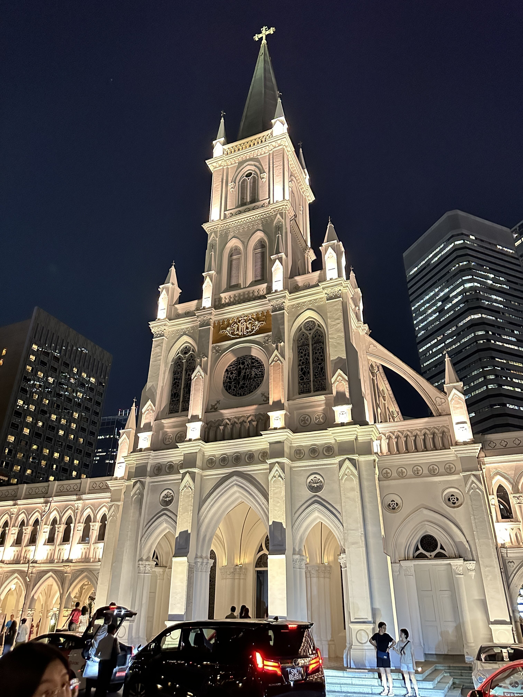
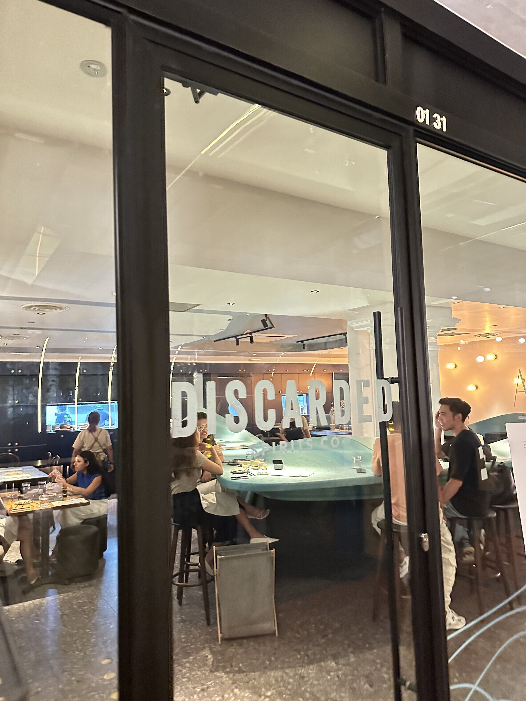
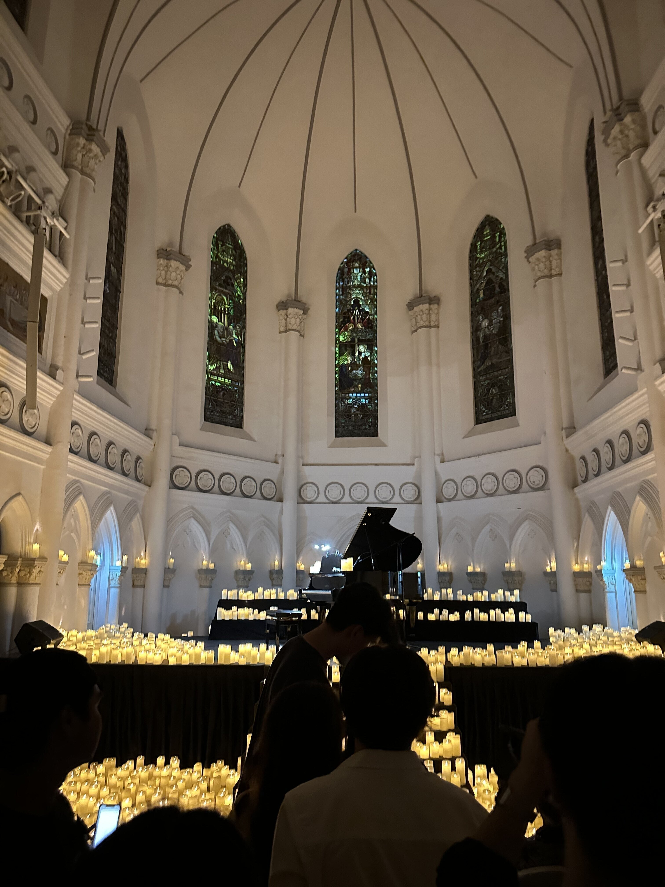
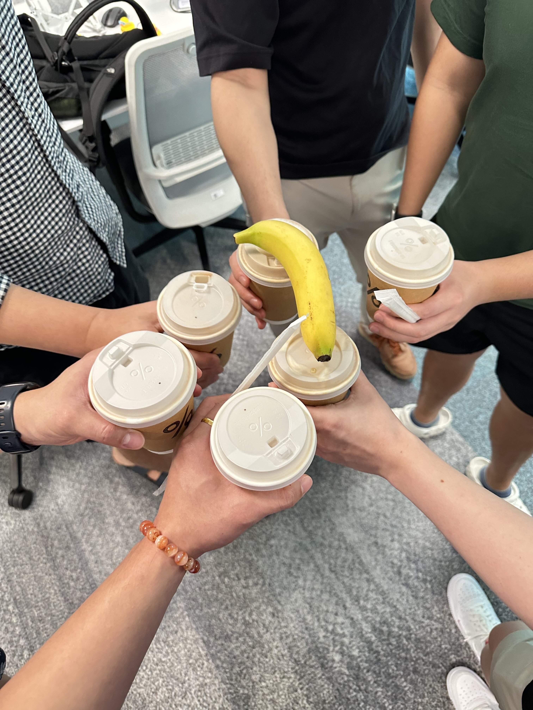
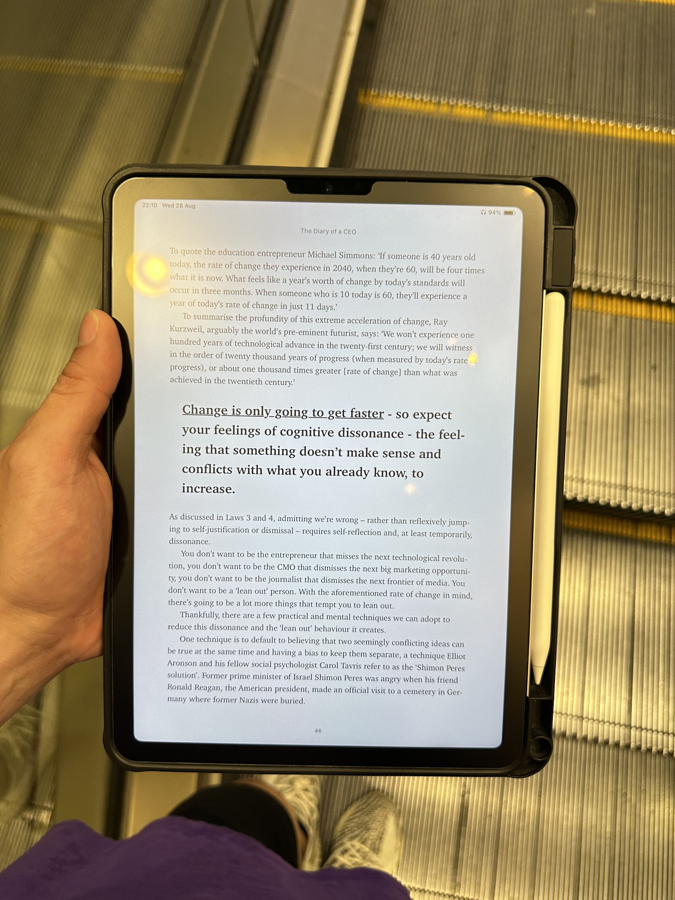
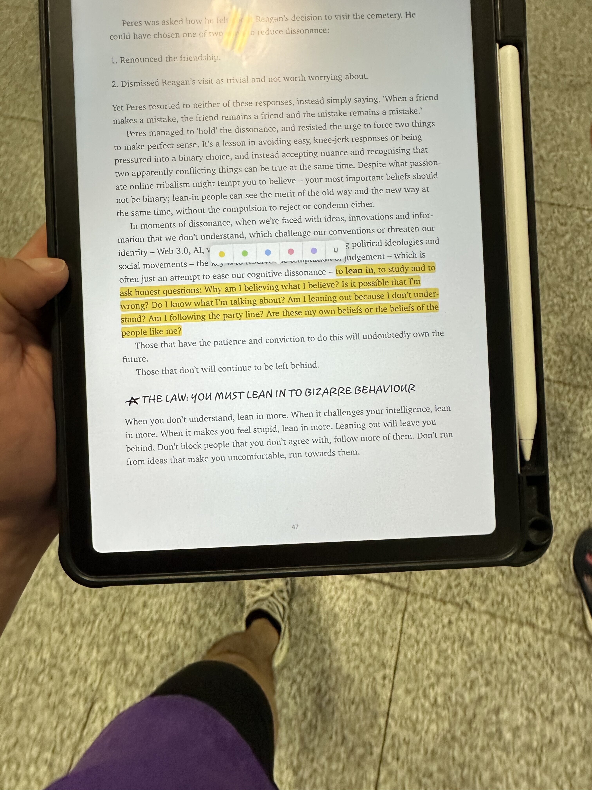
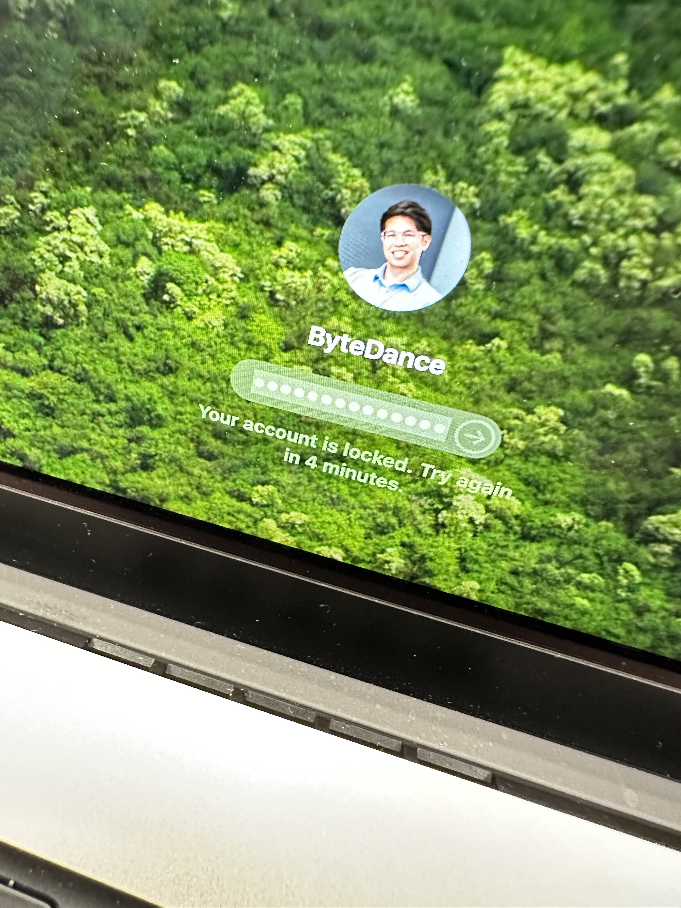
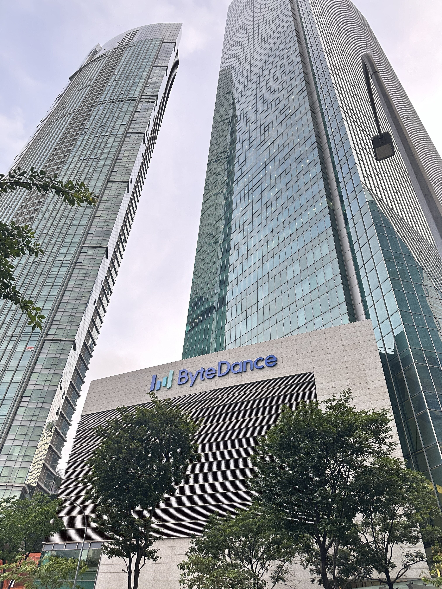
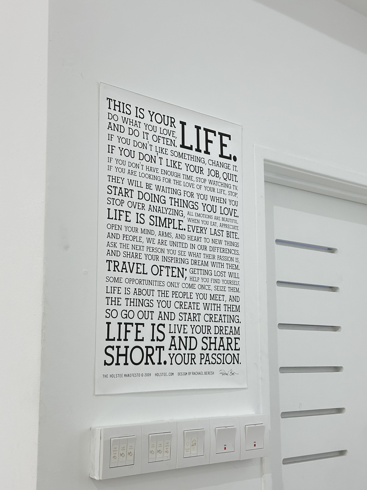
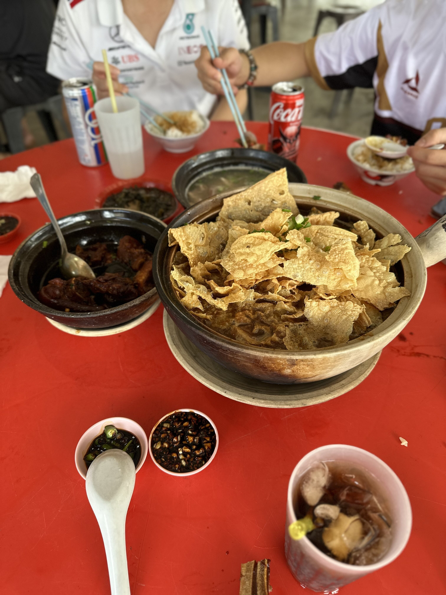

## ✨ Highlights of the Week
- **Exploring New Experiences:** this week was filled with firsts—tried Arabica coffee for the first time, went to a candlelight concert, and spent quality time with my brother and his gf. and... it's already been 9 months at ByteDance, but it feels more than a year, that's strange, time is quick and slow. time flies and drags at the same time, but it also gives me a moment to reflect on how much i've grown.

## Little Lesson
this week, i really resonated with a couple of concepts from **The Diary of a CEO**. one of them is the idea of **leaning into cognitive dissonance**—when you experience that uncomfortable feeling of encountering something that doesn't align with what you know, instead of retreating, it's important to lean in and explore it. this reminded me of how i've grown in my career, particularly at ByteDance. early on, i encountered a lot of situations where i felt out of my depth, but **pushing through those moments of discomfort is where the most growth happened**. for instance,

when i first started taking over a project that required a deep understanding of the business logic, it was unfamiliar and daunting at first. it was absolutely confusing and challenging, but by immersing myself in it, i not only learnt how that part of the business functions but also developed a new approach to problem-solving.

## 🥰 Memories

