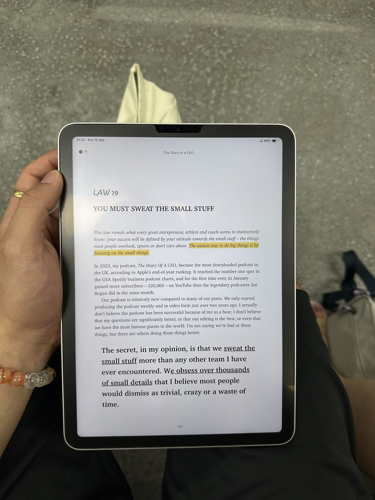
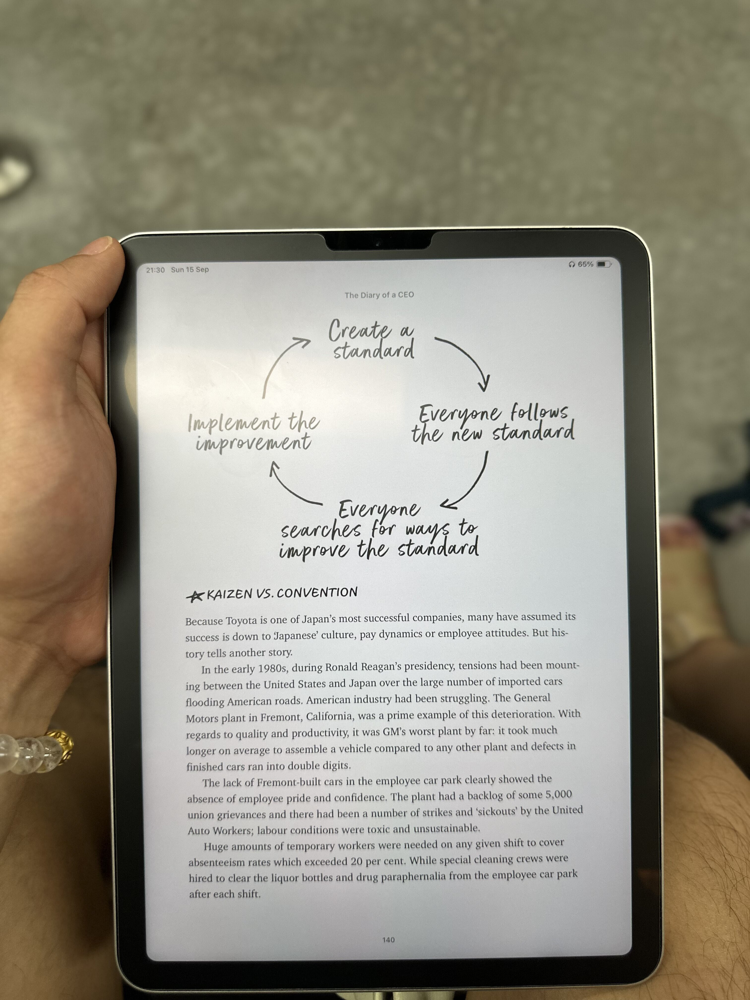
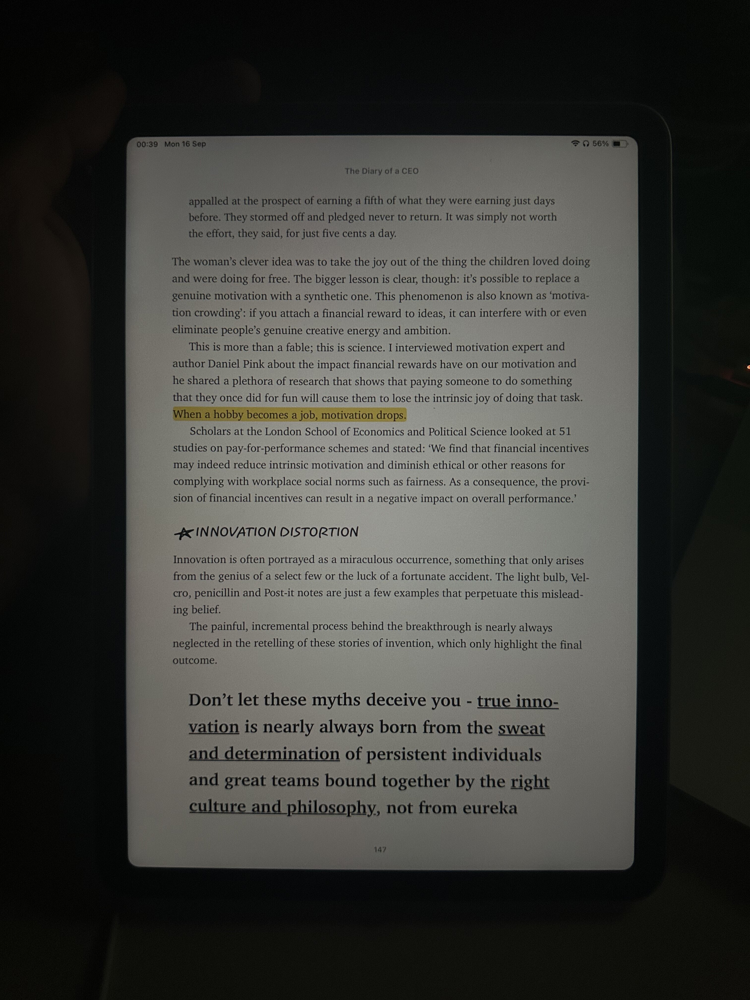

## ✨ Highlights of the Week
this week felt like a calm wave—steady and uneventful, but beneath the surface, there were hidden wins. i had a briefing meeting about a project that recently went live. hearing from the leaders that i managed to impress one of the toughest stakeholders? that hit me. hearing "you must've done a good job" felt like the validation i didn't even realise i needed. it's that kind of praise that fuels your spirit, knowing all the hard work really counts. 🥺

## 📝 Reading Insights
on the reading front, i'm still deep into **The Diary of a CEO**, and i stumbled upon a few ideas that truly resonated with me this week:

1. **"If you change the frame, you change your message"**—this is communication at its finest. i've come to see how true this is. it's not just about having the best ideas, but HOW you deliver them. the way you frame an idea can transform how it's received—this is something i see in my day-to-day work. even the most brilliant idea can fall flat if it's not presented in the right context. framing is an art that can make all the difference between confusion and clarity, and it's been a game-changer for me in how i communicate at work. it doesn't matter how brilliant or innovative you are, if you can't frame your ideas right, they will never land with the audience.

2. **"The easiest way to do big things is by focusing on the small things"**—this resonates so deeply with me because it mirrors my philosophy on growth. it's easy to overlook the small details, but it's in those small steps that the big leaps happen. for me, there's no shortcut to success. focusing on the little things every day, bit by bit, is what eventually leads to achieving the big goals. and when you trust the process, even the most impossible things start to feel within reach.

3. **"When a hobby becomes a job, the motivation drops."**-while beatboxing isn't my career, i started to feel this shift when my team Obelisk began prepping for paid performances. the fun we used to have during our jam sessions faded a little once we had to focus on delivering for an audience. it felt like the carefree creativity was replaced by structured rehearsals and deadlines, making it feel like a job. but despite this, i am pushing to keep the fun alive. it's a reminder that even when passions evolve, **it's important to hold on to the spark that started it all.**

## Visuals of the Week:

