## my last journal of 2024 🫶🏻

hello, dear reader!

it's been a while since my last journal, and now, here we are—days away from 2025. this marks my final journal entry for 2024, and there's so much i want to share!

december has been an intense month. so much has happened that i'm not even sure where to start. but let's take it one story at a time.

on the 6th of december, friday, i received some shocking announcements at work (the details are confidential, so i can't share much here). at that moment, i was completely thrown off—stunned and unsure how to react. you know those moments when life blindsides you? this was one of them. i didn't know how to process it, but i told myself, "what's done is done. all you can do now is focus on how you respond." so that's what i tried to do.

on the bright side, one part of the announcement i can share is that i got the opportunity to go on a solo business trip for a project i was responsible for! honestly, it was nerve-wracking—my first time traveling alone for work, handling everything by myself. i was unprepared, worried, and unsure. but looking back, i think i did okay. the trip taught me a lot, and after reflecting on it, i know there's still so much room for growth.

that friday was a blur. after the announcement, i had no time to process anything before rushing off to grab a quick lunch between meetings. it was a whirlwind of emotions—shock, confusion, gratitude, and everything in between. but amidst the chaos, my amazing team gave me a sweet moment to pause. they surprised me with a cake and coffee for my birthday! 🥺 they're honestly the best, and i felt so touched that they remembered despite how busy everything was. it was a reminder of how lucky i am to work with such thoughtful people. 😭

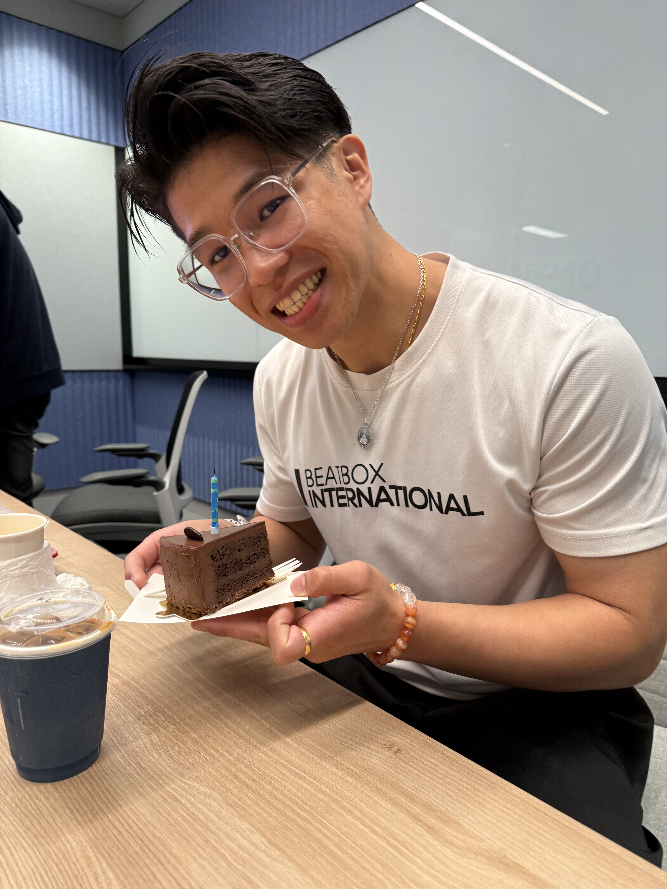

of course, there was no time to rest. meetings filled up the rest of the day. but shoutout to my colleague, **junjie**, who helped me sort out logistics like drafting my business travel letter. he made my life so much easier, and i'm super grateful for his kindness.

---

now, about the trip—Beijing was incredible! i finally got to visit ByteDance's headquarters at 大钟侍 and another office at 融中心. the 16-day business trip was a whirlwind of productivity and new experiences. my primary objective was to oversee the UAT process and ensure a successful project delivery. while the workload was intense, meeting colleagues and stakeholders in person brought a refreshing human connection that had been missing during months of remote collaboration. being on-site allowed me to dive deeper into project challenges, brainstorm solutions face-to-face, and even build stronger rapport with the team. honestly, it was more than just a work trip—it felt like an opportunity to grow both professionally and personally.

**融中心**:

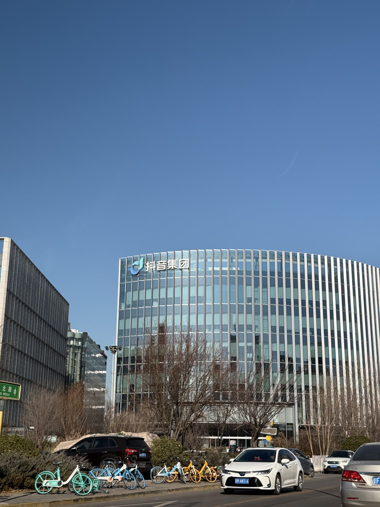

**大钟侍**:

<video width="auto" height="auto" controls>
  <source src="/journal-week-19/IMG_9275_compressed.mp4" type="video/mp4">
</video>

**curious about what my ByteDance life looks like, especially during my time in the Beijing offices?**

i've captured some highlights and behind-the-scenes moments from my journey in a special Instagram highlight titled **ByteDance 2** & **ByteDance 2.1**. feel free to check it out [here](https://www.instagram.com/enkr1/)—you might just catch a glimpse of my day-to-day adventures, the breathtaking office views, and the vibrant city life! 😊

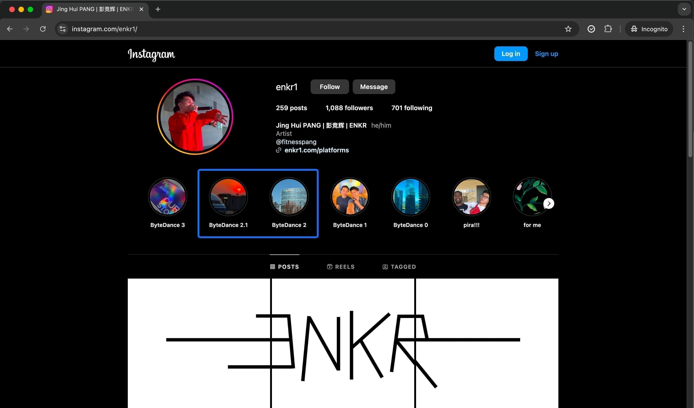

---

the weekends in Beijing were magical. i went on solo adventures, ticking off places i'd always wanted to visit. walking through the historical 胡同s, soaking in the vibe of the city—it felt like stepping into a movie. 🥺

one of my first stops was 天坛公园. i was in awe of the ancient chinese architecture—it's just so majestic and grand. every detail of the buildings felt like a glimpse into the past, and i couldn't help but admire how much history they carry.

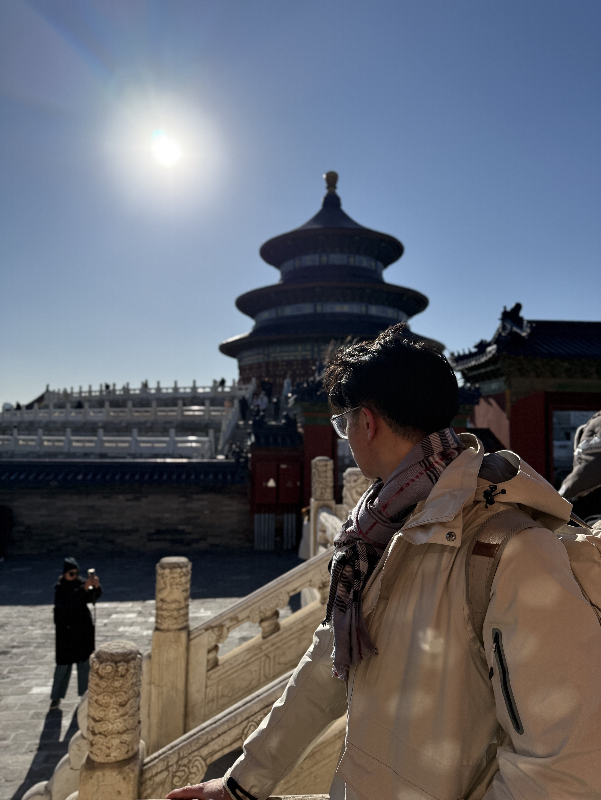

then, there was the 故宫—absolutely speechless. i mean, this was once the emperor's home... the sheer size of it left me in disbelief. i found myself wandering through the halls, just imagining what life must have been like back then.

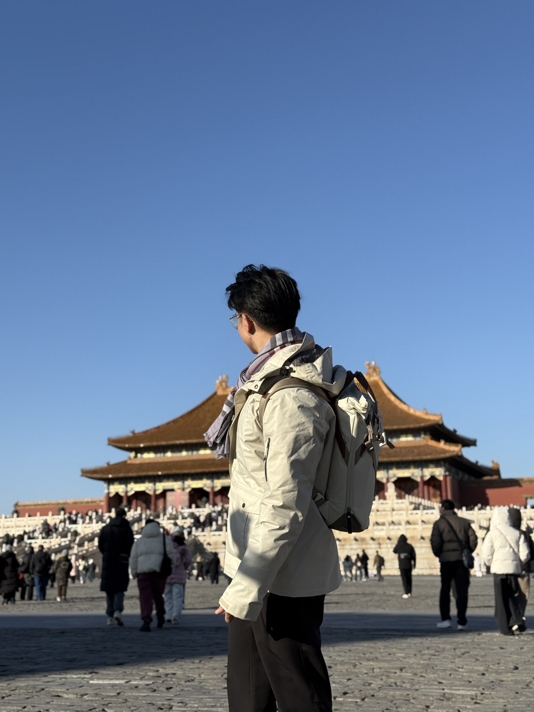

another highlight was finally trying 四季民福. i've seen it all over 小红书, and i can confirm—it totally lives up to the hype. the food was amazing, and it was such a treat to tick it off my list.

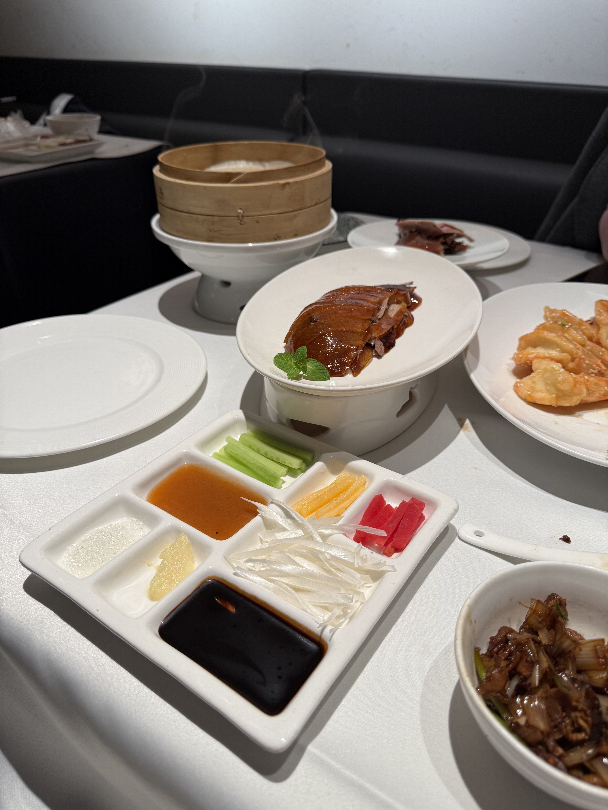

i also spent some time at 颐和园 and 圆明园, two parks that couldn't be more different but both so special in their own way. 颐和园 was so peaceful and relaxing, a perfect place to just slow down and take a breath. meanwhile, the ruins at 圆明园 felt like a quiet reminder of history, bittersweet yet humbling to see in person.

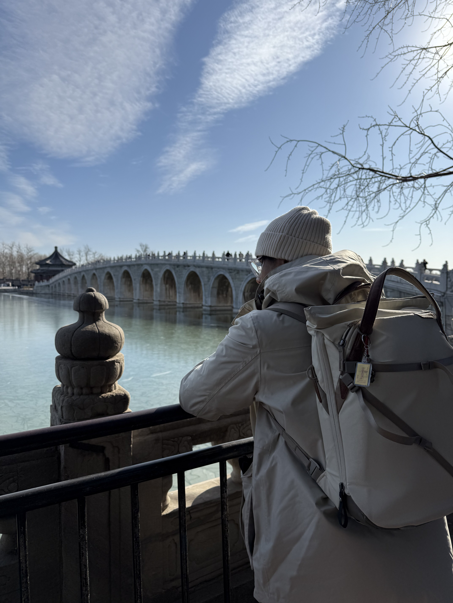
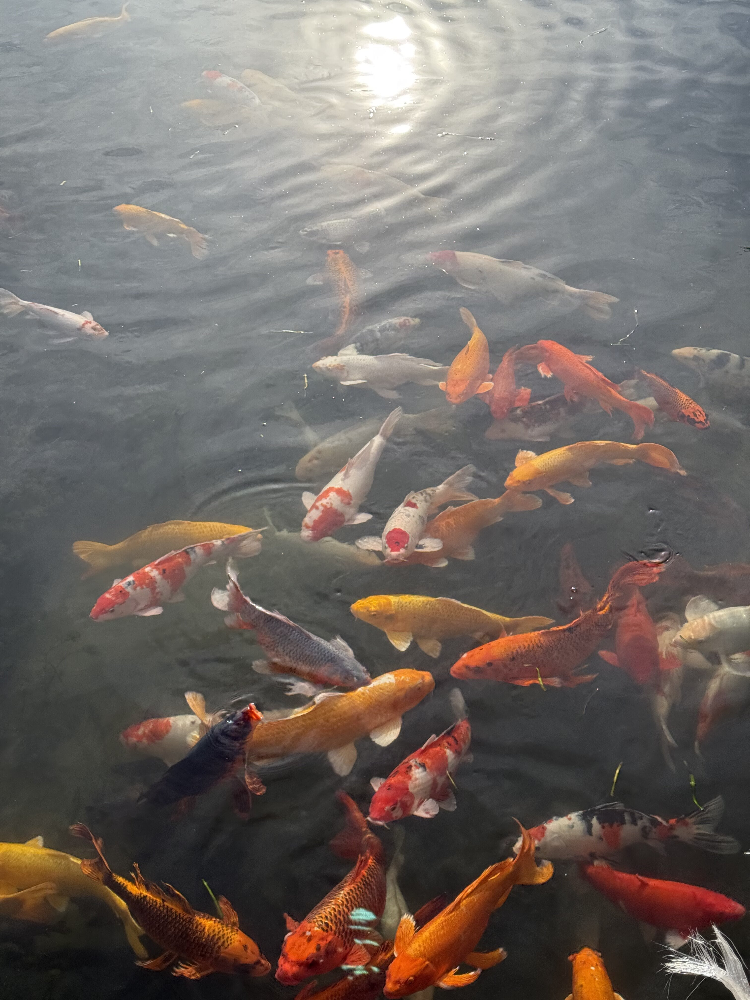
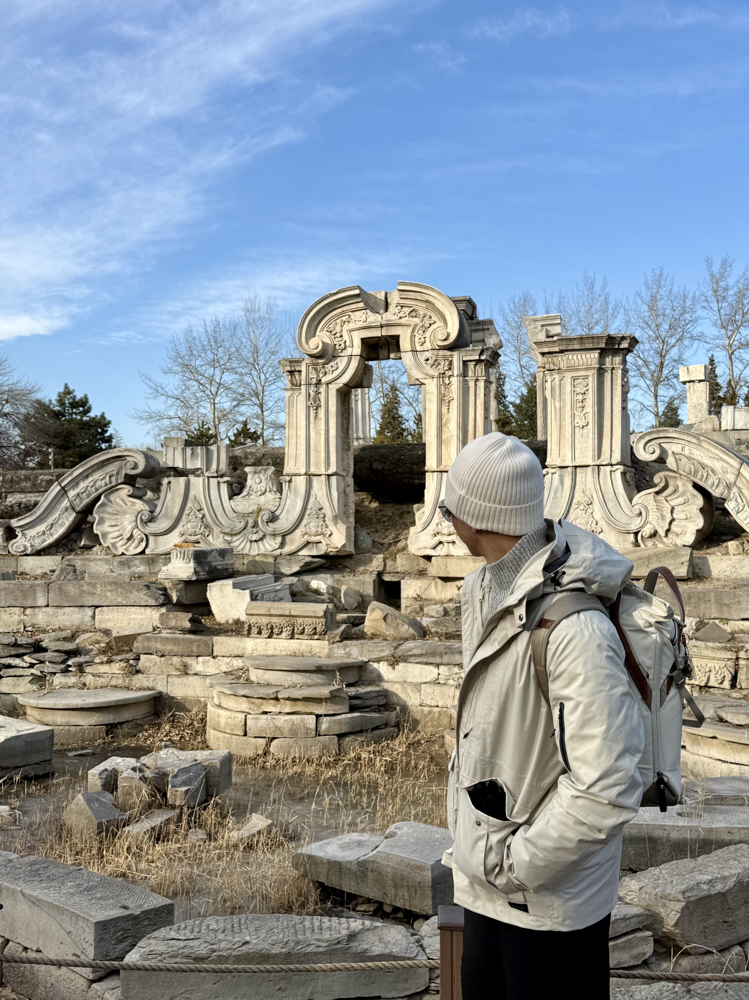

南锣鼓巷 was another favourite. i caught the sunset here, and let me tell you, it was breathtaking. Beijing's winter sunsets hit differently—so early, around 4pm, but the glow it left in the sky was unforgettable. 🌅

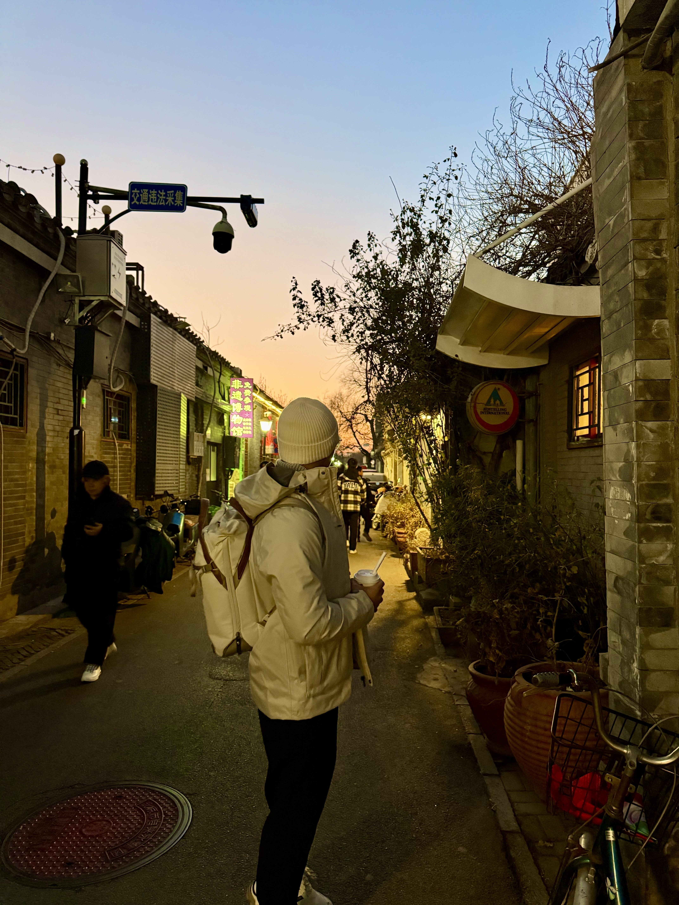

and, of course, i couldn't miss 什刹海, strolling by the lakes, surrounded by locals and tourists alike. it had such a vibrant energy, yet it felt calming at the same time.

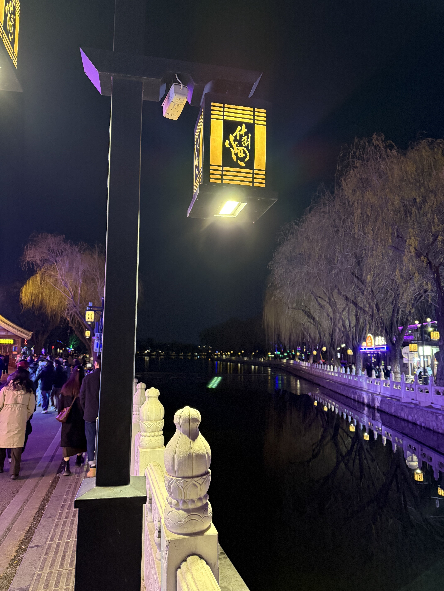

these moments brought me so much joy. every place i visited left an impression, and i know i'll carry these memories with me forever. Beijing really has a charm that's hard to put into words—it's a mix of history, culture, and just pure magic. 🥺🫶🏻

---

but as december went on, it wasn't all smooth sailing. just a week after the initial announcement, my leader shared that the decision had been cancelled. i hadn't even fully processed the first news when the second hit. it was an emotional rollercoaster—relief, confusion, and gratitude all at once. but i reminded myself: **What lies behind us and what lies before us are tiny matters compared to what lies within us.** life is unpredictable, and sometimes all you can do is adapt and move forward.

---

as the year-end approached, i took some much-needed leaves. i originally planned a trip to phuket in mid-december, but with the business travel and the critical project release, i had to cancel it. instead, i used the time to rest, recharge, and reflect. honestly, it turned out to be a blessing in disguise—having that "me time" was exactly what i needed.

before closing the year, my crew, Obelisk, and i worked on a countdown beatbox performance for the new year's eve celebration. it was such a fun project, and i'm so excited to see how it turns out on the 31st! 🎉

thank you for being part of my journey this year. ❤️

this isn't a full reflection of 2024—i'll save that for my next blog. but for now, here's to closing the year on a hopeful note.

bring it on, 2025! 🎯
