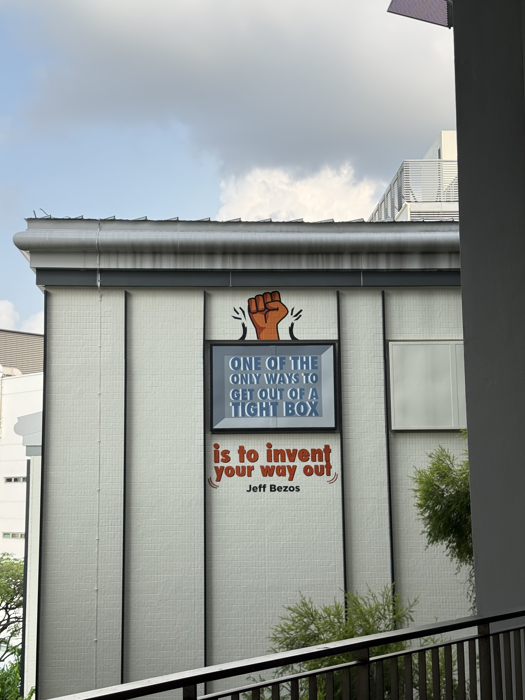
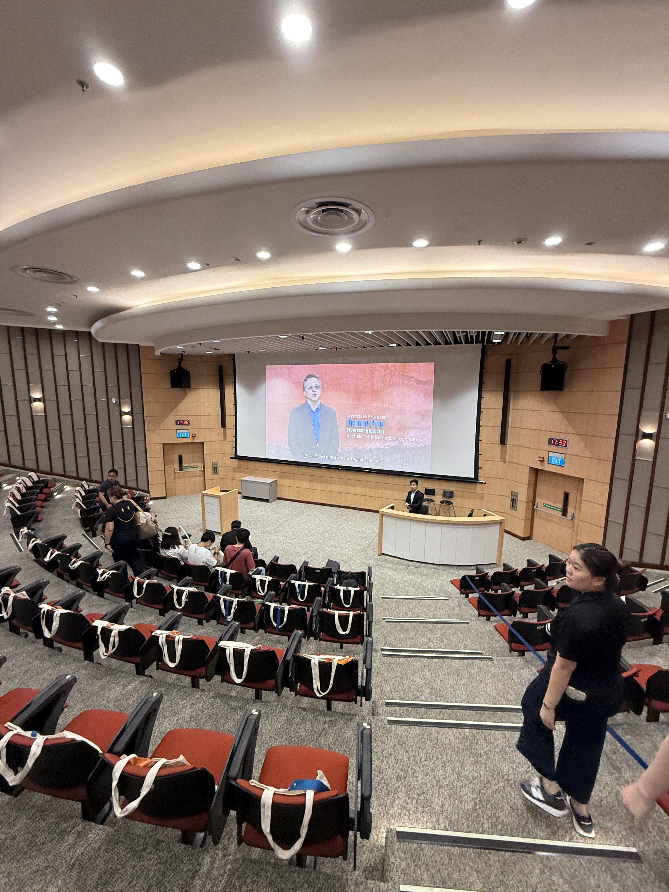
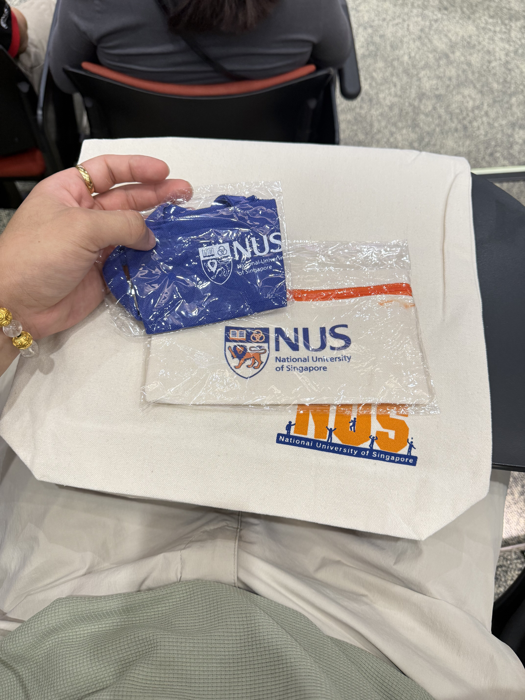
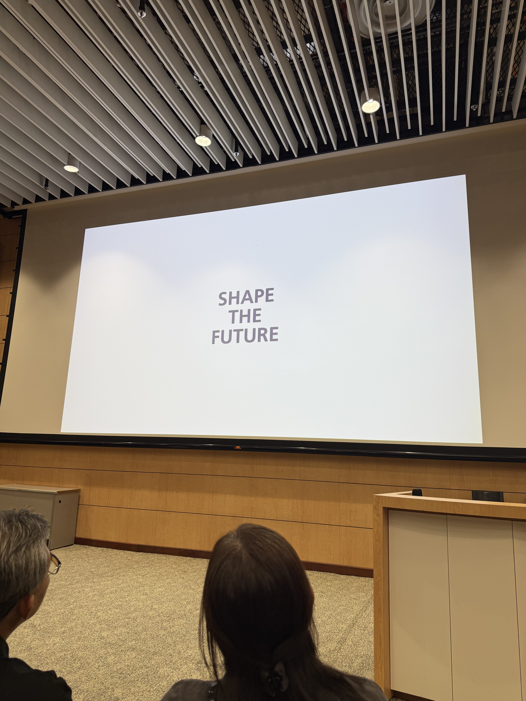
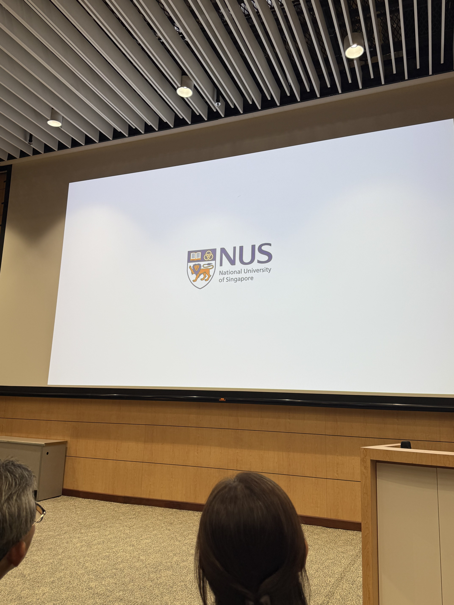

## ✨ Highlights of the Week

i'll probably write a separate post to reflect on the time i was gone (a major priority shift), but for now—last week marked a pretty special milestone:

i officially stepped into NUS as a student for the first time!
settled my student card, submitted the final application forms, and attended orientation!

i also got the chance to talk to a lot of people—some in the same life stage as me, some more senior (even with families to care for), and some just starting out in the field.

it was so inspiring to meet like-minded individuals, to feel that energy again.

it honestly reminded me of the vibe back in ByteDance—being surrounded by passionate, driven people who challenge and uplift you.

and now i can't wait to make the most out of these 3 short years as a student here at NUS!

during orientation, two seniors, YouSheng & Ben, shared some really practical advice, here are my top 3 takeaways:

1. **make full use of the library** – even though we're only the second cohort of this course, some past year papers and resources are already available!
2. **time management is key** – ben shared how hectic his work schedule is, and how he still manages to juggle it with school. inspiring stuff.
3. **attend lectures in person** – showing up for class is far more effective than skipping and rewatching at home (discipline, my old enemy... lol)

## 📝 Reading Insights

i've been diving into the book 《段位》 by 戈旭皎 recently—a thoughtful recommendation from my aunt.

each chapter tells a short story that illustrates the challenges we face at different stages of life, and how we might navigate through them.

what i love about this book is how it offers not just wisdom, but perspective—it's helping me better understand myself, and see more clearly how i want to improve.

truly one of those books that finds you at the right time. 📖🌱
