## ✨ Highlights of the Week

this week, i dedicated most of my time to planning and prepping for school—
i built a comprehensive notion database to "project manage" myself like a proper semester sprint 😆

also did a massive revamp of my old notion setups—it felt like a proper 大扫除! 😮‍💨

the cleanup gave me a better grasp of my course roadmap, module selection, and timetable structure.

i basically used all my workers (4o, o3, deepseek, kimi, doubao, claude, qwen) to help analyse my module content and get a clearer sense of which electives to prioritise.

oh—and i also imported my class timetable to my google calendar with NUS label (used 4o)! now, my school schedule is fully synced to my calendar, with important emails redirected to my personal inbox + labelled. everything in one place 🥰

another small win—i confirmed my advanced placement credits and got 40U granted!

which means... i only need 80U to graduate!!! 🎓

and guess what—i just started studying TXC1101, my first module.

so excited to keep this momentum going.

keep showing up, keep doing good. 💪

## 📝 Reading Insights

one key insight this week was about how we utilise our connections in life—not just network, but nurture them.

i've always been someone with a "thick face"-i constantly ask for feedback, seek honest advice, and maybe i've annoyed a few people in the process.. i guess? 🧐

but what i've come to realise is... asking for feedback is not just about improving myself.

it's also about building trust.

when people see you seriously applying their advice, they become your invisible coaches—they cheer for you without even realising it. as Chris Voss once said, "when someone tries to coach you, and you let them, they become emotionally invested in your success."

this hit home especially after reading 《段位》Rank—once your mentors recognise your determination, your desire to grow, and your goals, they'll help you. they'll think of you first when the next opportunity comes.

this week reminded me:

> *Asking isn't weakness. it's a sign of strength—because you're not just learning, you're co-creating your growth.*

## 🥰 Memories | July 28 - August 3

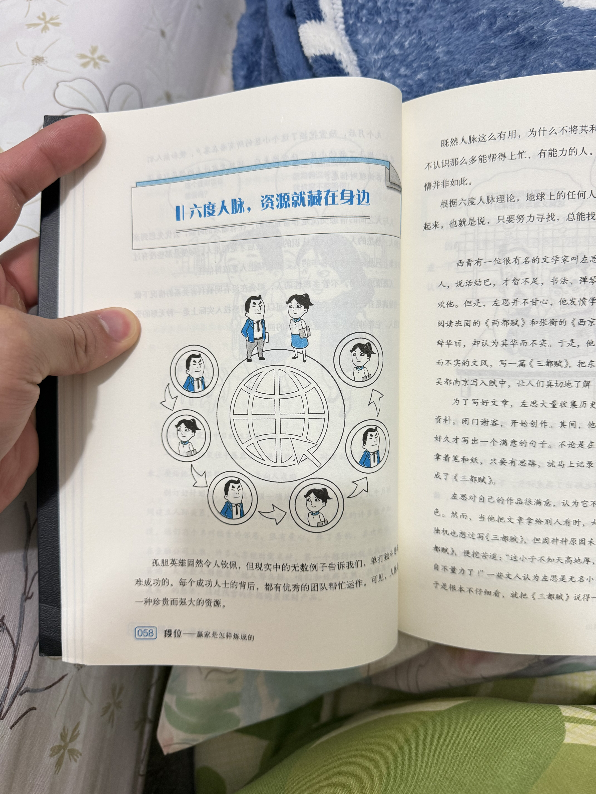
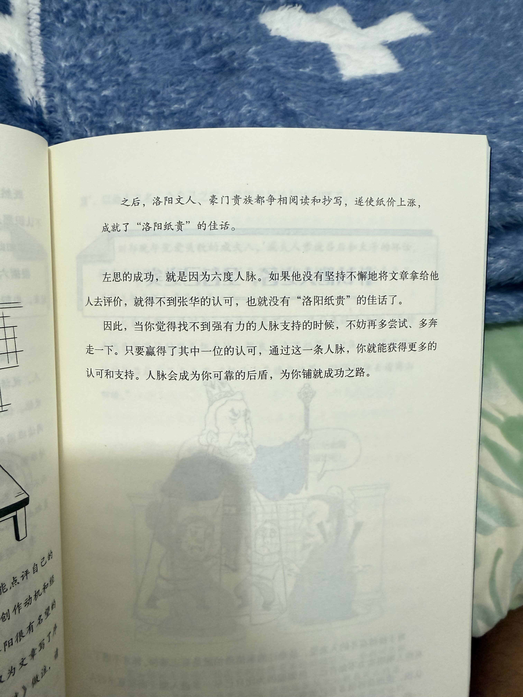
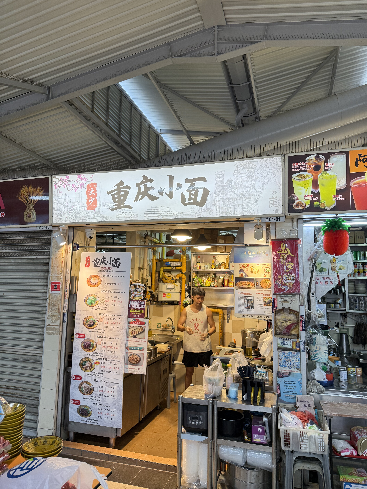
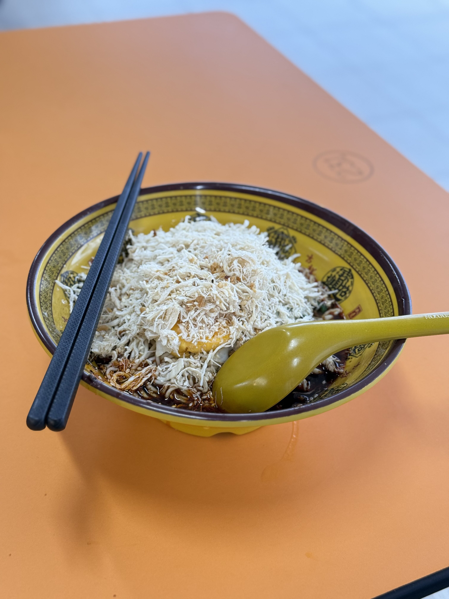
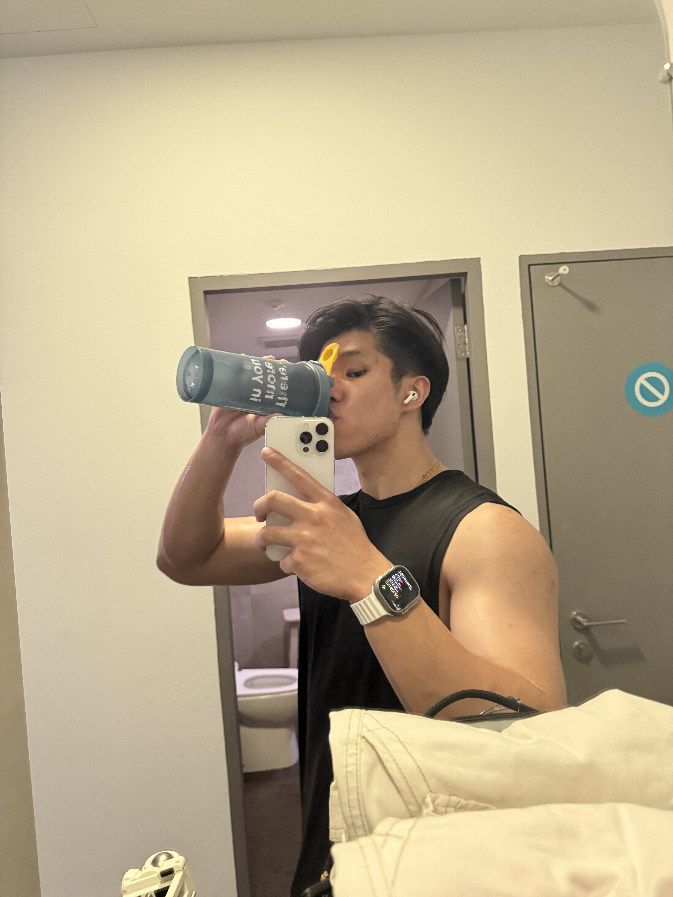

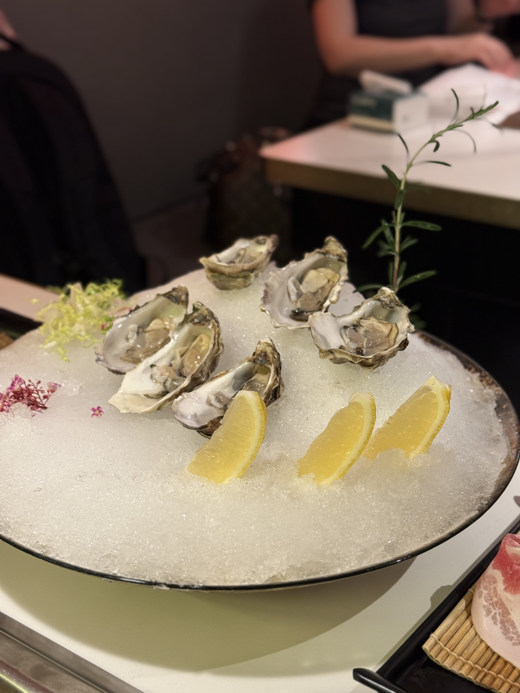
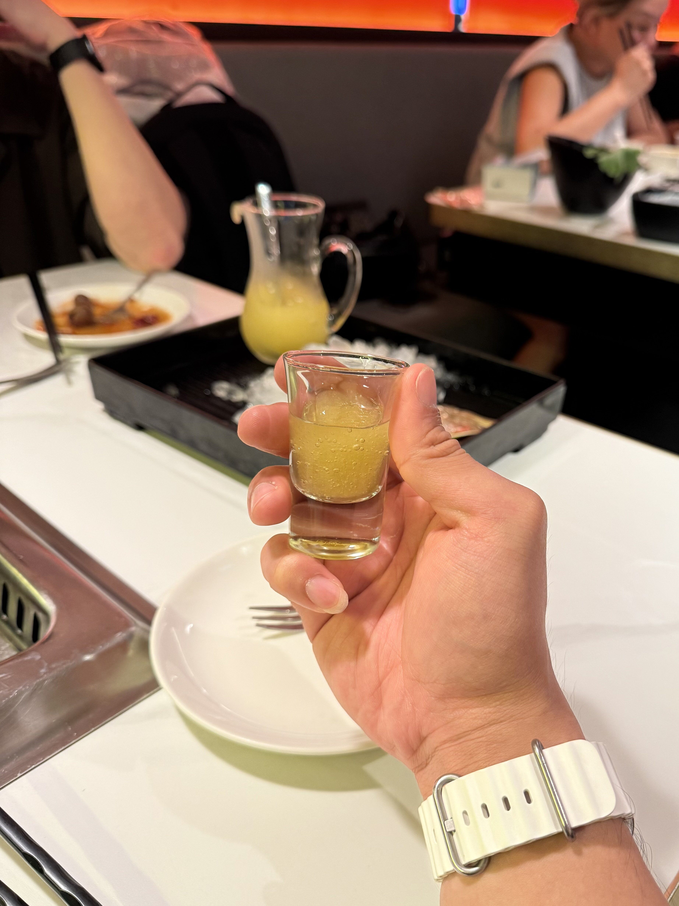
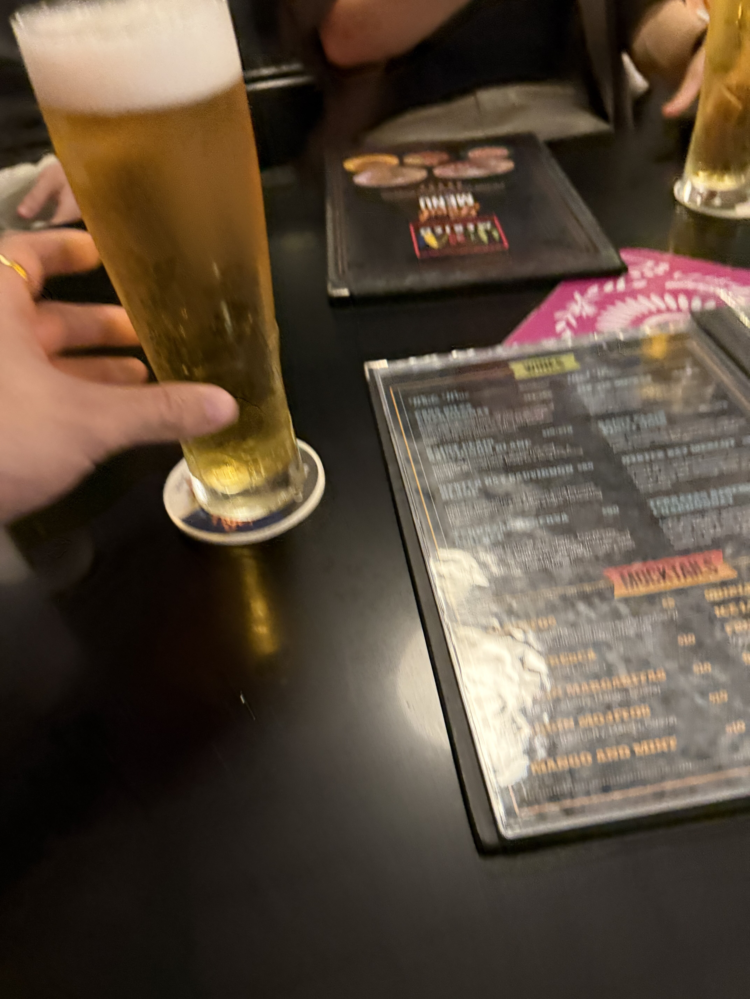
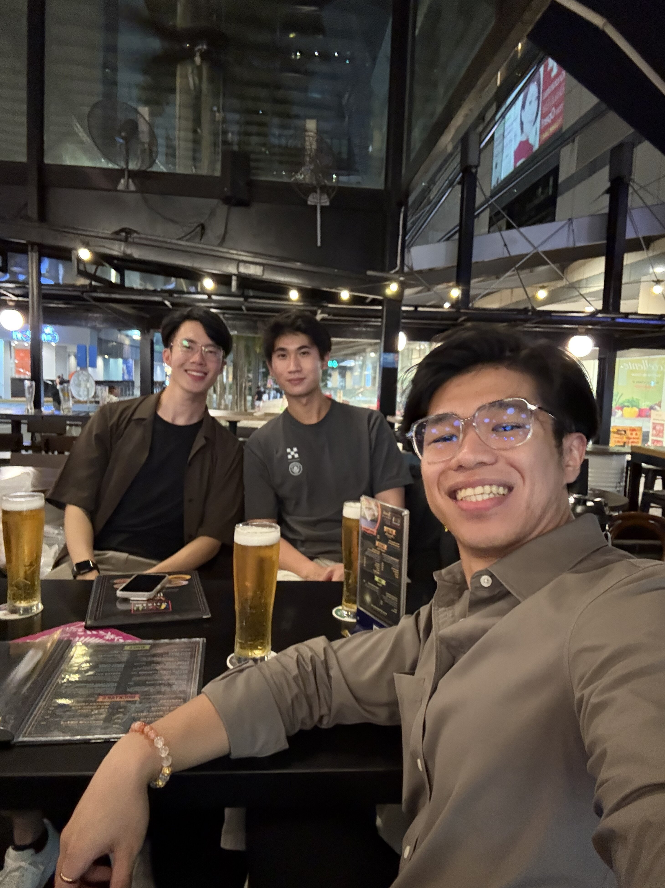
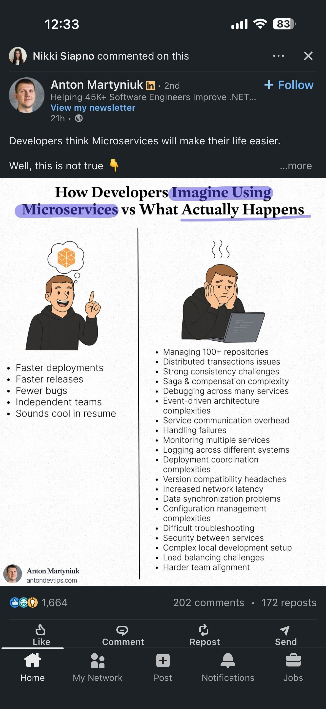
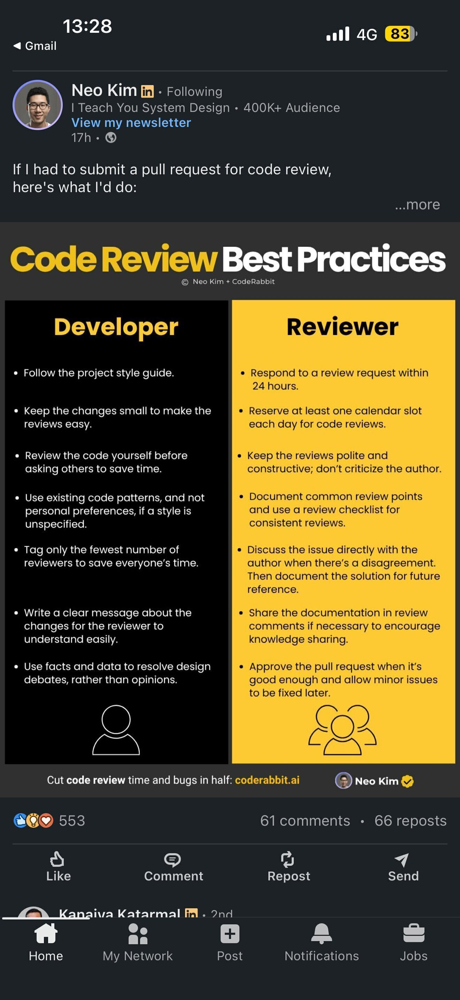

---

> wow, after 2 weeks of consistently journalling, i realised how important it is to journal. not just for the sack of writing things down, but for what happens in the process-when you write, you recall moments, you reminisce on the little things, reflect on your actions, and learn from every mistake you've made. i really love this process of slowing down, analysing, and understanding myself a little better each time. feels like i'm growing, one entry at a time. 🌱
