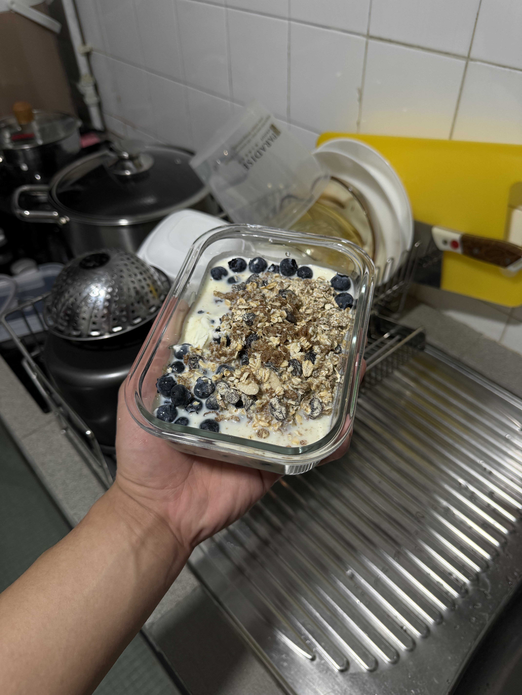

## ✨ Highlights of the Week

### 🍳 meal prep era

this week i finally took my meal prep a lil... more serious?? cuz my friend asked me: "why dont you buy an egg cooker urself and boil em in the morning to save money?" and i went to lazada immediately to just purchase an egg steamer, glass bowl, and the next day i bought greek yoghurt, cereal, blueberry, eggs and banana! and damn, indeed requires a bit more time to do all these but im on 3rd or 4th day now? i think im getting the hang of it! HOHOHO im loving it.

also been thinking about something. im so grateful to be alive to have the chance to absorb info like this, i think im just so lucky to be alive right now as somebody who's super curious in anything, adhd like me, i could literally get any info i want within a sec, but this made me realise something i have not been doing often which is to deep think, i have been seeing deepseek, claude code, showing the steps to think and it just hits me again, and it brought me some kind of weirdness seeing it doing the thinking FOR me instead of me DOING the THINKING... it's weird, grateful and unhappiness, just weird. and it reminds me that im the owner of everything im about to do, so i have the control, jinghui, read more, think more.

## 📋 Recap

### 📚 NUS

CT2 考完了 (5/10)，马上转战 CT3 prep — Sprint 3 正式开始。

#### TCX2101

- **Quiz 6.1-6.4 全过 5/5** (Mar 18，比 Friday sweep deadline 早了 2 天)。6.1 是目前最难的 quiz (10 attempts, 19 unique Q types)，但 6.4 invertible matrices 一次过！Hint-before-attempt method 验证成功
- **T8 class** (Mar 23) — Ch6.4-6.9 全覆盖：inverse via Gaussian elimination, elementary matrices, nilpotent, determinants + Cramer's rule。Pre-class drill 发现 permutation matrix inverse 还不太懂，flagged for review
- Exam intel: CT3 考 definitions + invertibility fundamentals，不是 heavy computation。Det confirmed critical for final。不用做 cubic polynomial long division

#### TCX1004

- **T4 submitted** (Mar 17) — Q1, Q3, Q6 graded questions reviewed。回家太累只看了重点
- **Week 9 Quiz 8/8** (Mar 21, 2 att) — PnC: permutations with repeats, stars & bars, complement counting

#### TCX1002

- **Mock Test 5** (Mar 19) — Library Fine System, OOP: inheritance + polymorphism
- **Tutorial 06 Q1-Q5** done (Mar 19-20) — OOP 题目，~90 min session
- **Combined Mid-Term Q5-Q8** captured (Mar 20) — 题目都记了，还没做

#### Meta

- Mastery level naming 统一了 — L1 Familiar / L2 Comfortable / L3 Confident / L4 Exam-ready，三个文件 (CLAUDE.md, Hugo dashboard, progress tracker) 全部对齐
- Workflow 拆分: automation (session notes, quiz MCP loop, sync, tracking)，Qwen for concept learning (single chat per question, proper math rendering)

### 🔧 Open Source

#### Coursemology

- **Copy code button** for programming files in grading view ([#4387](https://github.com/coursemology/coursemology2/pull/4387))
- **z-index Tailwind tiers** migration for shared components ([#5397](https://github.com/coursemology/coursemology2/pull/5397))
- **Blocked view fix** — show blocked view when instructor toggles student view ([#5488](https://github.com/coursemology/coursemology2/pull/5488))
- **Run Code hotkey** Ctrl+Shift+Enter ([#4972](https://github.com/coursemology/coursemology2/pull/4972))
- **Editor refactoring** — removed redundant RAF, switched to ResizeObserver polyfill, debounced resize, fixed effect deps

#### Ghostty

- `last_active_tab` feature 也 commit 了 ([#1844](https://github.com/ghostty-org/ghostty/pull/1844)) — 等 vouch approval 后就可以正式 submit PR

### 💡 Ideas

- **Blog idea:** T06 OOP tutorial reflection — "messy template = real work" angle。5 道题覆盖 full OOP progression (basic class → inheritance → state machine → multi-class design)。Key moment: Q5 从嫌 messy 到 realise 80% of work = reading someone else's code
