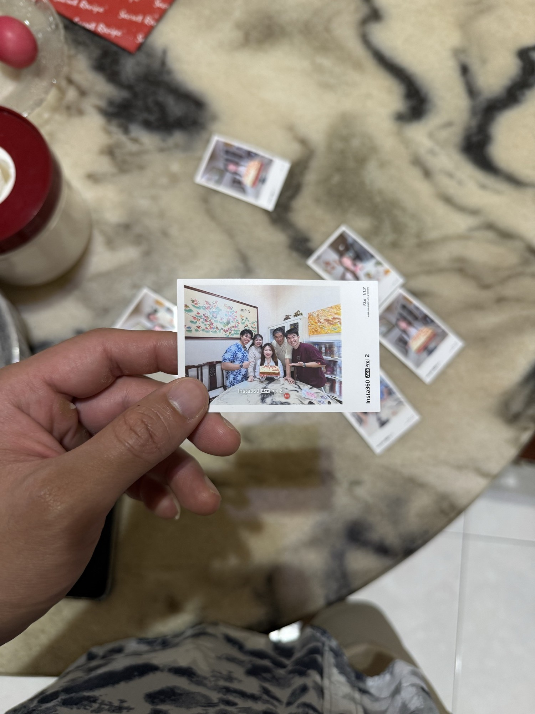
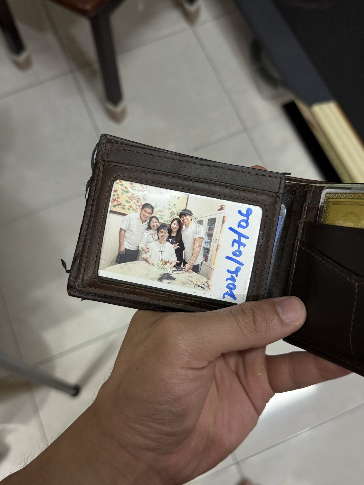

## ✨ Highlights of the Week

last week i wrapped up a coaching session with a student. after it i built a feedback loop on what i could've done better, then shared a plan with them. caught up over dinner with a gym fren, jae. sat my class test too, i was honestly quite lost during it, not confident at all, thought i'd done badly. got 18/20! AND i went back to jb early to celebrate my sister's and brother's birthdays!!!!

it'd been about six years since the five of us celebrated a birthday together, my brother was studying abroad in spain all that while. after so long, this time just hits different. i've always believed we're the strongest five: we trust each other, we believe in each other, we hold each other up. i think that's what family is for. i'm beyond grateful we got to live that moment together. thanks to insta360 for sponsoring my brother's ace pro 2 + the instant print thing. it was so memorable, so proud of how far we've come, and we'll only do better from here. so proud of my family. i'm so 知足、感恩、开心 that we get a little better every year, and i know we'll only keep going.

## 📋 Recap

### 📚 NUS

- Sat the TCX2003 coding class test in person. That was the last piece of graded coursework across both modules. Everything now comes down to the two finals next week.
- Fully into finals mode: building printed reference sheets and drilling past papers ahead of the exams.

### 🔧 Blog / Projects

- Shipped a research note on network effects: why value scales with the network, why n log n beats n squared, and how a crowd hardens into a moat.
- Shipped a research note on build vs buy: the cost crossover that sets the break-even point, and why cost alone never settles the call.
- A shoutout to my brother's storytelling hub, [busypang.enkr1.com](https://busypang.enkr1.com).
