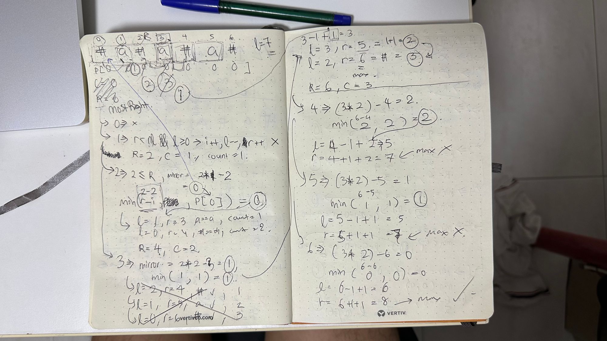
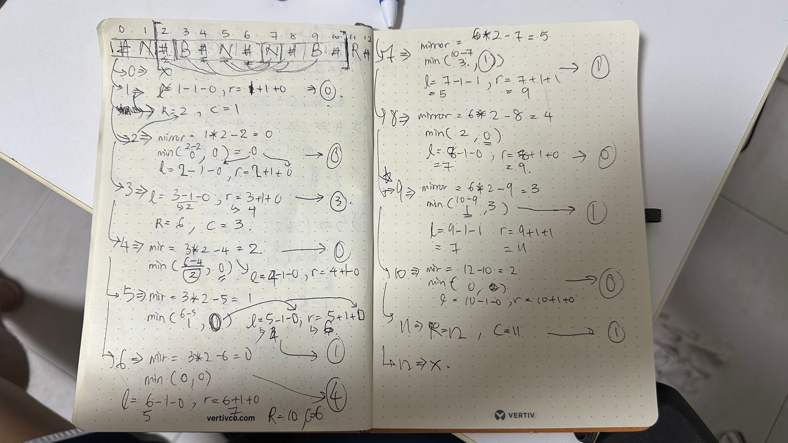

## Note for myself
- add special char just to partition them for expansion e.g. `#` → `#A#B#B#C#`
- initialise ⇒ `maxRight=0, palindromLengths=[], center=0`
- by looping it we check if the current `i` is within maxRight, if yes, we use a
    - `mirror = center*2 - i`
    - `min(maxRight - i, p[mirror])` for the case when the part of palindrome is not starting from `0`
- and every loop just move the `maxRight` and `center` when `i + p[i] > R` ⇒ `maxRight = i + p[i], center=i`
- case below is looking for the number of palindrome:
    ```js
    const countSubstrings = (s) => { // Manacher's algorithm
      let modifiedString = '#';
      for (let i = 0; i < s.length; i++) {
        modifiedString += s[i] + '#';
      }

      const n = modifiedString.length;
      const P = new Array(n).fill(0);
      let center = 0, right = 0;
      let count = 0;

      for (let i = 0; i < n; i++) {
        if (i <= right) {
          const mirror = 2 * center - i;
          P[i] = Math.min(right - i, P[mirror]);
        }

        let leftIndex = i - (1 + P[i]);
        let rightIndex = i + (1 + P[i]);

        while (leftIndex >= 0 && rightIndex < n && modifiedString[leftIndex] === modifiedString[rightIndex]) {
          P[i]++;
          leftIndex--;
          rightIndex++;
        }

        if (i + P[i] > right) {
          center = i;
          right = i + P[i];
        }

        count += Math.ceil(P[i] / 2);
      }

      return count;
    };
    ```

> rewind please its hard to actually memorise - do it again!

---

## What is Manacher's Algorithm?
Manacher's algorithm is an efficient algorithm used to find the **longest palindromic substring in a given string**. It was invented by Gustav Manacher in 1975. The algorithm works by using the properties of palindromic substrings to avoid unnecessary comparisons, thereby reducing the overall time complexity.

Overall, Manacher's algorithm is a very elegant and efficient solution to the problem of finding the longest palindromic substring in a given string.

The algorithm uses two key ideas:

1. Symmetry property: A palindrome has a symmetry around its `center`. If we already know the palindrome of a `center`, we can use it to avoid checking characters that cannot be part of a longer palindrome.
2. Dynamic Programming: We can use previous calculations to compute new ones.

*The Manacher's algorithm has a time complexity of O(n), where n is the length of the string, which makes it very efficient.*

Here's how the Manacher algorithm works:

1. Preprocess the input string `s` by inserting a special character, such as '#', between each pair of characters to make the string odd-length. For example, the string "abba" would become "#a#b#b#a#".
2. Initialise two arrays:
    1. `P`, where `P[i]` stores the length of the longest palindromic substring centered at `i`, and
    2. `C`, where `C[i]` stores the center of the longest palindromic substring found so far.
3. Set a variable called `maxRight` to `0`, which represents the rightmost boundary of the longest palindromic substring found so far, and set `center` to `0`, which represents its center.
4. Iterate through the string `s` from left to right, and for each character `i`, do the following:

    a. If `i` is within the current palindromic substring (i.e., i <= maxRight), set `P[i]` to `min(P[2 * center - i], maxRight - i)`, which means the palindrome centered at `i` is a reflection of the palindrome centered at center.

    b. Expand the palindrome centered at `i` by comparing characters `s[i - P[i] - 1]` and `s[i + P[i] + 1]`. If they are equal, increase `P[i]` by `1`.

    c. If the expanded palindrome centered at `i` extends beyond `maxRight`, update `maxRight` and `center` accordingly.

5. Find the maximum value in the `P` array, and its corresponding `center` index. The longest palindromic substring is then the substring centered at this index, with length `P[center] - 1`.

---

## For myself
My workaround:



## References
- [YouTube - LeetCode Solution - 5.0 Longest Palindromic Substring | Manacher Algorithm 100% Beat](https://youtu.be/l-XCWjps-UQ?si=he8GEc2W7kbGeCOC)
