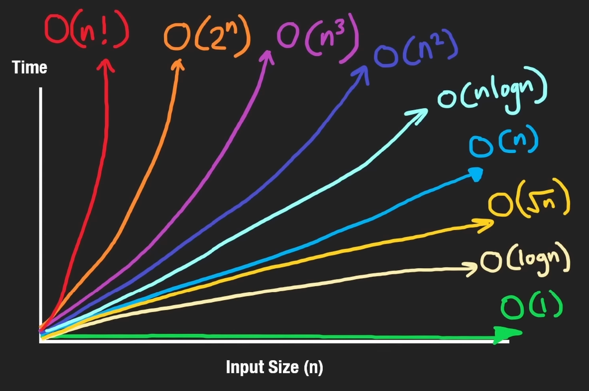
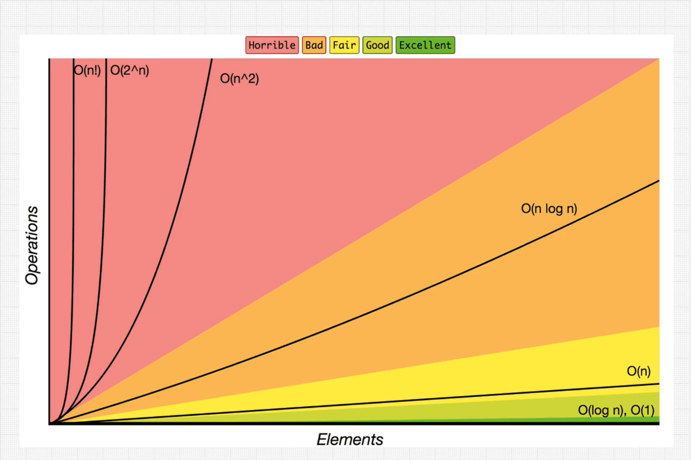

## Understanding Big-O Notation
Big-O is like **planning for the heaviest traffic during rush hour**—it helps you understand the maximum time an algorithm might take to complete, preparing you for the **worst-case scenario**.


## `O(1)`: Constant Time Complexity
- **Efficiency**: Highest possible, as execution time remains constant regardless of input size `n`.
- **Behavior**: Performance does not change; operations complete almost instantly.

### Common Examples:
- Accessing an element by `index` in an array.
- Adding or removing the last element in a stack (push/pop operations).
- Inserting or deleting the first element in a queue.

### Coding Examples:
Array operations:
```py
nums = [1, 2, 3]
nums.append(4)  # Append operation at the end
nums.pop()      # Pop operation at the end
print(nums[0])  # Access by index; look up
```

Dictionary operations:
```py
hash_map = {'key': 10}
hash_map['new_key'] = 20      # Insert operation
print('new_key' in hash_map)  # Check existence
print(hash_map['new_key'])    # Access by key
hash_map.pop('new_key')       # Remove by key
```

---

## `O(log n)`: Logarithmic Complexity
- **Efficiency**: Highly efficient for large datasets as it reduces the problem size by **half each step**.
- **Application**: Common in algorithms that divide the problem space into smaller segments, typically seen in binary operations.

### Common Examples:
- **Binary Search**: Quickly locates an element in a sorted array by repeatedly dividing the search interval in half.
- **Binary Search Tree (BST) Operations**: Efficiently find, insert, or delete nodes.
- **Divide and Conquer Algorithms**: Like the "Guess the Number" game, which narrows down the possible answers with each guess by halving the range.

### Coding Examples:
Example of Binary Search in Python:
```py
nums = [1, 2, 3, 4, 5]
target = 3
l, r = 0, len(nums) - 1
while l <= r:
    m = (l + r) // 2
    if nums[m] < target:
        l = m + 1
    elif nums[m] > target:
        r = m - 1
    else:
        print(f"Target found at index {m}")
        break
```

Example of Binary Search on a Binary Search Tree (BST):
```py
def search_bst(root, target):
    if not root:
        return False
    if target < root.val:
        return search_bst(root.left, target)
    elif target > root.val:
        return search_bst(root.right, target)
    else:
        return True
```

Using a Min Heap:
```py
import heapq
min_heap = []
heapq.heappush(min_heap, 5)  # Insert into heap
heapq.heappop(min_heap)      # Remove from heap
```

---

## `O(sqrt(n))`: Square Root Complexity
- **Efficiency**: Uncommon but effective for certain types of problems, especially those involving factorisation or searching.

### Coding Examples:
This example demonstrates how to find all factors of a number, efficiently using `O(sqrt(n))` complexity by iterating only up to the square root of the number.

Finding all factors of `n`:
```py
import math
n = 12
factors = set()
for i in range(1, int(math.sqrt(n)) + 1):
    if n % i == 0:
        factors.add(i)
        factors.add(n // i)
# Output the factors
print(factors)
```

> This approach significantly reduces the number of iterations needed to find all factors of `n` by using a `set`, making it faster than a typical `O(n)` solution that checks every number up to `n`.

---

## `O(n)`: Linear Complexity
- **Efficiency**: Increases linearly with the size of the input. The time complexity grows directly proportional to the input size `n`.
- **Behavior**: The worst-case runtime involves iterating through all elements, making it predictable and straightforward.

### Common Examples:
- **Traversing** an array or linked list to process each element.
- **Deleting** a specific position in a linked list where traversal is required.

### Coding Examples:
This section demonstrates various `O(n)` operations in Python, including array manipulation and heap operations.

```py
nums = [1, 2, 3]

# Summing elements of an array
total = sum(nums)
print("Sum:", total)

# Looping through the array
for n in nums:
    print("Element:", n)

# Inserting at a specific index
nums.insert(1, 100)
print("After Insert:", nums)

# Removing an element
nums.remove(100)
print("After Remove:", nums)

# Checking for element existence
print("Is 100 present?", 100 in nums)
```

Converting array into a heap:
```py
import heapq
heapq.heapify(nums)
print("Heapified array:", nums)
```

> As well as nested loops example (e.g., sliding window technique) - complexity depends on the operations inside the loop.

These examples highlight how `O(n)` complexity appears in typical data manipulation tasks and some algorithms where operations scale linearly with the input size.

---

## `O(n log n)`: Linearithmic Complexity
- **Efficiency**: Extremely effective for operations that combine linear traversal with logarithmic processes, often seen in sorting algorithms.
- **Characteristics**: This complexity is typical where you combine a linear process with a step that divides the problem set (*logarithmically*).

### Common Examples:
- **Merge Sort**: Efficiently combines smaller sorted arrays into larger ones.
- **Heap Sort**: Builds a heap and then sorts by removing the largest or smallest element repeatedly.
- **Quick Sort**: Selects a pivot and partitions the array around it, sorting the partitions recursively.
- **Certain Divide and Conquer Algorithms**: Optimises `O(n^2)` algorithms by breaking the problem into smaller parts and solving them individually.

### Coding Examples:
Here we demonstrate how heap sort and merge sort operate, reflecting `O(n log n)` complexity.

HeapSort example in Python:
```py
import heapq
nums = [5, 3, 1, 4, 2]

# Building the heap from the list, O(n)
heapq.heapify(nums)
sorted_nums = []

# Removing the smallest element until the heap is empty, O(log n) each
while nums:
    sorted_nums.append(heapq.heappop(nums))

print("HeapSort result:", sorted_nums)
```

MergeSort example (using Python's built-in sorting which is typically Timsort):
```py
nums = [5, 3, 1, 4, 2]
sorted_nums = sorted(nums)  # Utilizes a variation of merge sort with O(n log n) complexity
print("MergeSort result:", sorted_nums)
```

These examples underscore how `O(n log n)` operations are pivotal in efficient data processing, particularly in sorting and optimising complex algorithms.

---

## `O(n^2)`: Quadratic Complexity
- **Efficiency**: Common in algorithms that involve pairs of elements or **nested iterations**, leading to performance that scales as the square of the input size.
- **Characteristics**: Often observed in simpler or **brute-force** sorting algorithms and when dealing with two-dimensional data structures.

### Common Examples:
- **Bubble Sort**: Repeatedly steps through the list, compares adjacent elements and swaps them if they are in the wrong order.
- **Insertion Sort**: Builds the final sorted array one item at a time by inserting elements at their correct position.
- **Selection Sort**: Repeatedly selects the smallest (or largest) element from the unsorted portion and moves it to the end of the sorted portion.
- **Traversing a 2D Array**: Iterates over each row and column of a matrix.

### Coding Examples:
These examples demonstrate typical scenarios where `O(n^2)` complexity occurs, including iterating through a 2D array and implementing a basic sorting algorithm.

Traverse a square grid in Python:
```py
nums = [[1, 2, 3], [4, 5, 6], [7, 8, 9]]
for i in range(len(nums)):
    for j in range(len(nums[i])):
        print(nums[i][j], end=' ')
    print()
```

Get every pair of elements in an array:
```py
nums = [1, 2, 3]
for i in range(len(nums)):
    for j in range(i + 1, len(nums)):
        print(f'Pair: ({nums[i]}, {nums[j]})')
```

Example of Insertion Sort:
```py
def insertion_sort(nums):
    for i in range(1, len(nums)):
        key = nums[i]
        j = i - 1
        while j >= 0 and key < nums[j]:
            nums[j + 1] = nums[j]
            j -= 1
        nums[j + 1] = key

nums = [3, 2, 1]
insertion_sort(nums)
print("Sorted array:", nums)
```

These snippets underline the impact of quadratic complexity, especially evident in data processing and sorting operations where each element must interact with others in a nested manner.

---

## `O(n*m)`: Multiplicative Complexity
- **Efficiency**: Encountered in situations where the performance depends on the product of **two different dimensions**, such as in rectangular grids or operations involving two different datasets.
- **Characteristics**: Similar to `O(n^2)` in scenarios where both dimensions can vary independently.

### Common Examples:
- **Cross-product Operations**: Generating all possible pairs from two different lists or arrays.
- **Traversing a Rectangular Grid**: Iterating through each cell of a grid that does not necessarily have equal dimensions (e.g., a 2x3 grid).

### Coding Examples:
The following snippets illustrate how `O(n*m)` complexity manifests, by showing operations on arrays of different lengths and a rectangular grid traversal.

Get every pair of elements from two different arrays:
```py
nums1, nums2 = [1, 2, 3], [4, 5]
for i in range(len(nums1)):
    for j in range(len(nums2)):
        print(f'Pair: ({nums1[i]}, {nums2[j]})')
```

Traverse a rectangular grid:
```py
nums = [[1, 2, 3], [4, 5, 6]]
for i in range(len(nums)):
    for j in range(len(nums[i])):
        print(nums[i][j], end=' ')
    print()  # New line after each row
```

These examples highlight the computational considerations when dealing with operations that require accessing elements across two dimensions or datasets, each influencing the total number of operations performed.

---

## `O(n^3)`: Cubic Complexity
- **Efficiency**: Generally inefficient due to the high runtime, especially as the size of `n` increases. Often impractical for large datasets.
- **Characteristics**: Typically appears in algorithms that involve **three nested loops**, affecting performance significantly as each layer adds another dimension of iteration.

### Common Examples:
- **Triple Nested Loops**: Used to generate all possible triplets from an array, which is common in certain mathematical or **brute-force** solutions.

### Coding Example:
This example illustrates a simple cubic complexity scenario where all unique triplets from an array are printed. Such operations are computationally intensive and **usually avoided in performance-critical applications**.

Print all unique triplets in an array:
```py
nums = [1, 2, 3]
for i in range(len(nums)):
    for j in range(i + 1, len(nums)):
        for k in range(j + 1, len(nums)):
            print(f'Triplet: ({nums[i]}, {nums[j]}, {nums[k]})')
```

This code efficiently demonstrates an `O(n^3)` complexity by iterating through three nested loops to produce every combination of three elements without repetition. The example is straightforward, highlighting the nature of cubic complexity in a clear and concise manner.

---

## `O(2^n)` / `O(c^n)`: Exponential Complexity
- **Efficiency**: Highly inefficient for large values of `n` due to the exponential growth in the number of operations.
- **Characteristics**: Often associated with recursive functions where the number of recursive calls doubles or increases by a constant multiplier at each step.

### `O(2^n)`:
- **Use Case**: Commonly appears in recursive algorithms that explore all possible combinations or paths, such as in computing the Fibonacci sequence or solving decision problems.
- **Example**: Computing the Fibonacci sequence recursively where each call generates two further calls.

#### Coding Example for `O(2^n)`:
Fibonacci sequence using recursion, which doubles the calls at each step:
```py
def fibonacci(n):
    if n <= 1:
        return n
    return fibonacci(n - 1) + fibonacci(n - 2)

# Testing the function
print(fibonacci(5))  # Output: 5 (0, 1, 1, 2, 3, 5)
```

### `O(c^n)`:
- **Explanation**: This complexity arises when the recursive function expands by more than two branches per call, typically influenced by an additional variable or parameter `c`, which can sometimes be dependent on `n`.

#### Coding Example for `O(c^n)`:
General exponential recursion where c branches out depending on the input size:
```py
def exponential_recursion(i, nums, c):
    if i >= len(nums):
        return 0
    total = 0
    # The loop creates multiple branches per recursion, depending on c
    for j in range(1, c + 1):
        if i + j < len(nums):
            total += exponential_recursion(i + j, nums, c)
    return total

# Example usage with c branches
nums = [1, 2, 3, 4, 5]
c = 3
print(exponential_recursion(0, nums, c))  # Output depends on specific conditions and `nums` length
```

Both examples illustrate the complexity and **potential inefficiencies** of exponential growth in recursive algorithms, particularly when the problem size or parameters allow recursive calls to multiply rapidly. These complexities are **typically avoided in practical applications** unless optimisations or memoisation techniques are applied to reduce the impact of redundancy in recursive calls.

---

## `O(n!)`: Factorial Complexity
- **Efficiency**: Extremely slow and typically impractical for large `n` due to the **exponential increase** in the number of operations required.
- **Characteristics**: Factorial complexity occurs in scenarios where you need to generate all possible permutations of a dataset, which grows factorially with the number of elements.

### Common Examples:
- **Travelling Salesman Problem (TSP)**: Solved via **brute-force** search by evaluating every possible route to determine the shortest possible path.
- **Generating Permutations**: Producing all possible orderings of a set without any restrictions.
- **Laplace Expansion**: Used to compute the determinant of a matrix, where each expansion adds factorial growth in complexity.
- **Set Partitions**: Enumerating all distinct ways to partition a set into non-empty subsets.

These examples involve extensive computations as the input size increases, making them highly inefficient for larger datasets. Due to the nature of factorial growth, *such complexities are often theoretical or restricted to very constrained or small-scale problems in practical applications.*


## Big-O Notation Cheat Sheet

| Complexity   | Description                                                                                                                    |
| ------------ | ------------------------------------------------------------------------------------------------------------------------------ |
| `O(1)`       | Constant - The fastest and most efficient complexity, where operations complete in the same time regardless of the input size. |
| `O(log n)`   | Logarithmic - Efficiency scales with the logarithm of the input size, typical in binary search.                                |
| `O(n)`       | Linear - Runtime grows directly in proportion to the input size.                                                               |
| `O(n log n)` | Linearithmic - Combines linear and logarithmic complexities; common in efficient sorting algorithms like mergesort.            |
| `O(n^2)`     | Quadratic - Often results from nested loops; each element is processed multiple times.                                         |
| `O(n^3)`     | Cubic - Similar to quadratic, but with three nested loops; less common due to high inefficiency for large data sets.           |
| `O(2^n)`     | Exponential - Doubling with each additional element; common in recursive algorithms solving the subset problems.               |
| `O(n!)`      | Factorial - The slowest and least efficient; associated with algorithms that generate all permutations of a dataset.           |
| `O(n^n)`     | Exponential - Extreme cases where the complexity grows exponentially with the number of elements raised to their own power.    |


---

## Notes for Myself
- Case such as `n + nlogn`, we don't need to say the first `n` because in Big-O notation we only care about the larger term *if they are the same variable*. so we can just say: `nlogn`.
- BUT, case like `m + nlogn`, we have to mention the `m` in `m + nlogn` because `m` is a different variable.


---


## References:

- https://neetcode.io/courses/lessons/big-o-notation
- https://stackoverflow.com/questions/1592649/examples-of-algorithms-which-has-o1-on-log-n-and-olog-n-complexities
