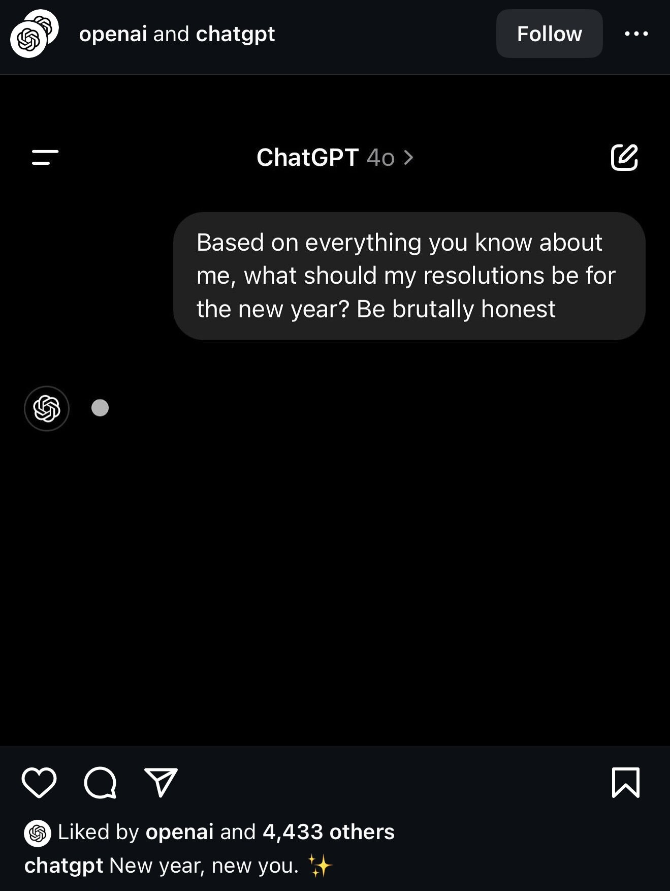

---


the question i asked:
```plaintext
Based on everything you know about me, what should my resolutions be for the new year? Be brutally honest
```


---


## ChatGPT 4o
Here are some tailored resolutions for the new year, based on your profile and goals. They aim to address growth opportunities, refine your strengths, and challenge your limitations:

1. Sharpen Focus on Long-Term Career Goals

    •	**Why?** You have a strong technical foundation and leadership experience, but you're still seeking alignment between your current work and the broader industry.

    •	**Action:** Set a clear 5-year plan and evaluate each project for its relevance to your ultimate goals (e.g., transitioning to a dream company like Google or excelling in high-impact roles like Production Engineer). Prioritise skills and projects that bring you closer to these goals.

2. Build Depth in Key Technologies

    •	**Why?** Your expertise spans a wide array of tools and platforms, but depth in fewer cutting-edge technologies (e.g., Elixir or advanced DevOps practices) can set you apart.

    •	**Action**: Commit to mastering one high-demand technology. Build a side project that demonstrates your expertise, with the goal of open-sourcing it or presenting it at a tech conference.

3. Elevate Your Personal Brand

    •	**Why?** Your personal website and online presence are strong, but refining them with the modern polish and interactivity you aim for can elevate your visibility.

    •	**Action**: Finish the v4 of your website, ensuring it reflects your skills dynamically (e.g., interactive portfolios, engaging visuals, and a story-driven “About Me”). Incorporate beatboxing to showcase your unique personality alongside professional achievements.

4. Prioritise Consistency Over Intensity

    •	**Why?** Your projects often reflect deep effort but suffer from scope creep and delayed timelines. This pattern could affect perception of reliability in team or stakeholder settings.

    •	**Action**: Break big goals into manageable, measurable chunks. Use tools like OKRs to stay consistent and realistic about deliverables. Document progress clearly to manage expectations.

5. Embrace Vulnerability and Human Connection

    •	**Why?** Your focus on professionalism sometimes overshadows the emotional authenticity that builds deeper relationships. This may affect personal and professional connections.

    •	**Action**: Let go of perfectionism in relationships (both personal and professional). Share your challenges, seek genuine feedback, and make room for imperfections in others as well.

6. Balance Hectic with Holistic

    •	**Why?** Your gym schedule and work ethic are commendable but seem to leave little room for reflection and emotional recharge.

    •	**Action**: Integrate mindfulness or journaling into your routine. Dedicate one day a month to complete disconnection—no coding, no emails, no gym. Use it for rest, reading, or exploring something entirely new.

7. Date with Clarity and Confidence

    •	**Why?** Your reflections on past dates show emotional depth but a tendency to overanalyse.

    •	**Action**: Approach dating as an opportunity to learn and enjoy, not as a test. Set clear boundaries and communicate your intentions upfront. Trust your instincts to know when someone isn't the right fit.

8. Invest in Financial Literacy

    •	**Why?** You've shown interest in investments like fractional stocks, but expanding financial acumen could offer long-term stability and freedom.

    •	**Action**: Dive deeper into investment strategies. Consider automating contributions to ETFs like VOO, learning about REITs, or exploring small-scale entrepreneurial ventures like owning an Anytime Fitness gym.

9. Advocate for Yourself and Your Team

    •	**Why?** You're often focused on solutions and projects, but advocating for your team's or your own success could position you as a stronger leader.

    •	**Action**: Practice self-promotion without hesitation. Document team wins and challenges, and share them openly with stakeholders to highlight value and leadership.

10. Let Go of ‘What Ifs'

    •	**Why?** Reflections on relationships, missed deadlines, or professional missteps sometimes hold you back.

    •	**Action**: Embrace a growth mindset. Celebrate the lessons from failures without overanalysing what could have been. Channel this into actionable steps for the future.

Would you like me to help break down any of these resolutions into specific actions?


---


## ChatGPT 1o
Below are several suggestions for your New Year's resolutions, tailored to what I understand are your aspirations and experiences. I have endeavoured to be frank yet constructive, and I hope these ideas will provide a solid foundation for the year ahead.

1. Pursue Further Education with Purpose

> You have mentioned an interest in obtaining a part-time degree. Be brutally honest with yourself about which area of study will best complement both your technical and managerial career path. If you are convinced a degree is necessary, commit wholeheartedly: map out a detailed plan of how you'll balance work, study, and personal life. If not, channel the same drive into pursuing targeted professional certifications in cloud architecture, data engineering, or even executive leadership.

**Example Resolution**: “I will decide on a specific programme or certification by 1 March and formalise my enrolment or study schedule by the following month.”

2. Hone Your Leadership Skills

> You are already adept at managing teams and liaising with clients, but leadership is a lifelong pursuit of refinement. Focus on areas you may find challenging—maybe delegation, conflict resolution, or inspiring innovative thinking. Solicit candid feedback from peers, subordinates, and mentors; it might be uncomfortable, but that's where growth happens.

**Example Resolution**: “I will organise quarterly ‘listening sessions' with my team to gather honest feedback on my leadership style and commit to implementing at least one suggested improvement each quarter.”

3. Strengthen Your Technical Core

> Although you are already highly competent in multiple coding languages, take a brutally honest look at your ‘weak links'—the newer technologies or deeper aspects of a technology you use daily but haven't truly mastered. It might be advanced concepts in Elixir or leveraging the full potential of Terraform for large-scale infrastructure. Even the strongest technical leads are never done learning.

**Example Resolution**: “I will complete a hands-on project or course in a cutting-edge framework (e.g., a new data processing tool or advanced AWS service) and share the results with my team by mid-year.”

4. Pay Attention to Work–Life Balance

> While you are clearly industrious, burnout is a real risk. Whether it's allocating time for fitness, mindfulness, or creative hobbies, ensure you are not running on fumes. Consistency here is key; commit to a routine that supports your mental and physical well-being.

**Example Resolution**: “I will take two 20-minute breaks per workday for a brisk walk or short workout session, ensuring I log these activities to keep track of my consistency.”

5. Expand Your Global Perspective

> With your multilingual abilities, you have a strong base for intercultural communication. If you feel comfortable in your current languages, consider brushing up on business-level proficiency or diving into a new language. Alternatively, explore the cultural nuances and global aspects of your field—understanding international markets and user experiences could give you an edge in project management and product design.

**Example Resolution**: “I will read at least one book or research paper every month on international tech markets or cross-cultural leadership, summarising the insights for my team.”

6. Refine Your Personal Brand

> Beyond simply doing great work, think about how you present your expertise and leadership. If you have not done so already, build or update a personal website or portfolio showcasing your coding contributions, project management experience, and professional philosophy. Cultivate thoughtful social media posts or LinkedIn articles on your technical and managerial insights.

**Example Resolution**: “I will publish two in-depth articles on LinkedIn or a personal blog this year, focusing on topics such as best practices in DevOps or effective client-stakeholder communication.”

7. Continue Exploring New Ideas for Personal Growth

> You've shown interest in seeking guidance and exploring less conventional paths (such as consulting a fortune teller). Keep an open mind about any avenue that helps you clarify your goals. At the same time, keep a healthy balance between external guidance and your own intuition. Sometimes introspection—through journalling or speaking with a trusted mentor—can provide more practical clarity than you might expect.

**Example Resolution**: “I will commit to monthly personal reflection sessions—whether that's with a mentor, a professional counsellor, or through a structured journaling process—to ensure I'm aligning my professional and personal objectives.”

Extra Topics You Might Enjoy Exploring Further

1. Open-Source Leadership

    •	Investigate how contributing to or initiating open-source projects can sharpen your technical and collaboration skills.

2. Emerging Tech for Sustainability

    •	Explore how technology can tackle environmental challenges; your background could be pivotal in making a positive impact in green tech initiatives.

3. Behavioural Economics in Tech

    •	Delve into how user behaviour and decision-making can influence product design, enhancing your UI/UX expertise.

4. Philosophies in Leadership

  	•	Read about Stoicism or other schools of thought, seeing how they might inform steadier, more empathetic leadership styles.

**Conclusion**

In being brutally honest, the main point is not to overcommit. A handful of well-chosen resolutions—executed thoroughly—will accomplish more than a grand wish-list you cannot realistically maintain. Each resolution should serve a clear purpose: professional advancement, well-being, or personal fulfilment. By staying true to your vision, proactively seeking feedback, and broadening your expertise, you'll be far better positioned to navigate the coming year with confidence.

I wish you every success in following through with your goals, and I hope these resolutions provide some direction for a fulfilling and impactful new year.

---

## Reflections on the Advice

wow... i'm speechless... the advice from both ChatGPT 4o and 1o is incredibly insightful and thought-provoking. it's like they've seen through my facade and pinpointed areas where i need to grow, improve, and take action. i have so much to digest and reflect on. i will keep updating this post as i work on these resolutions and share my progress. here's to a year of growth, challenges, and transformation. 🌟
