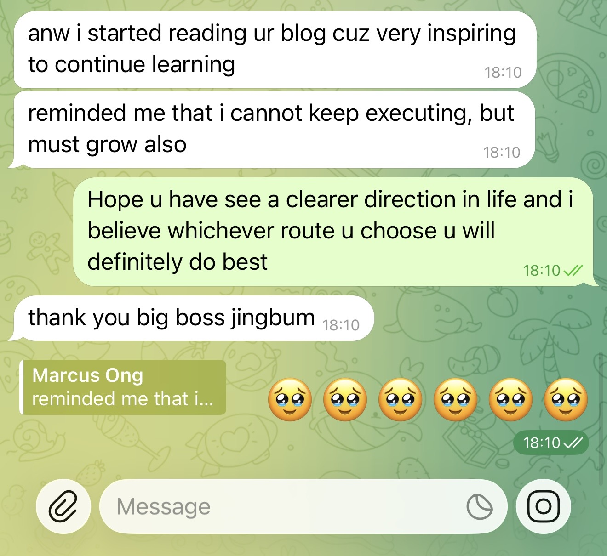


i started reading ur blog cuz very inspiring to continue learning. reminded me that i cannot keep executing, but must grow also.


when i saw marcus say that to me, i found this special feeling.. that whenever my work, my writing, my energy could help lift people up, for those of my friends who read my blog, i love yall so much 🥺❤️ i've been doing this mainly for sharing the knowledge i know to those who might need it, and yea, i find it a really good way instead of meditating, or maybe better? when i write out my thoughts, sharing what i learnt, i'm actually deepening my memories somehow, and by doing so, i think. i actually think.
