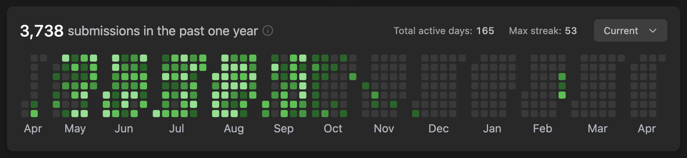
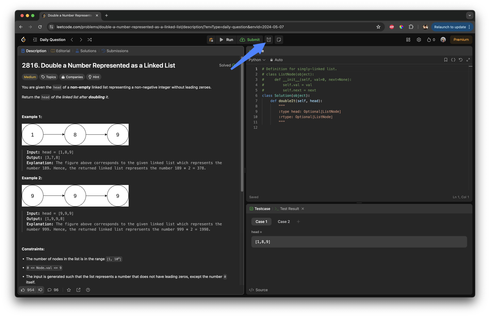
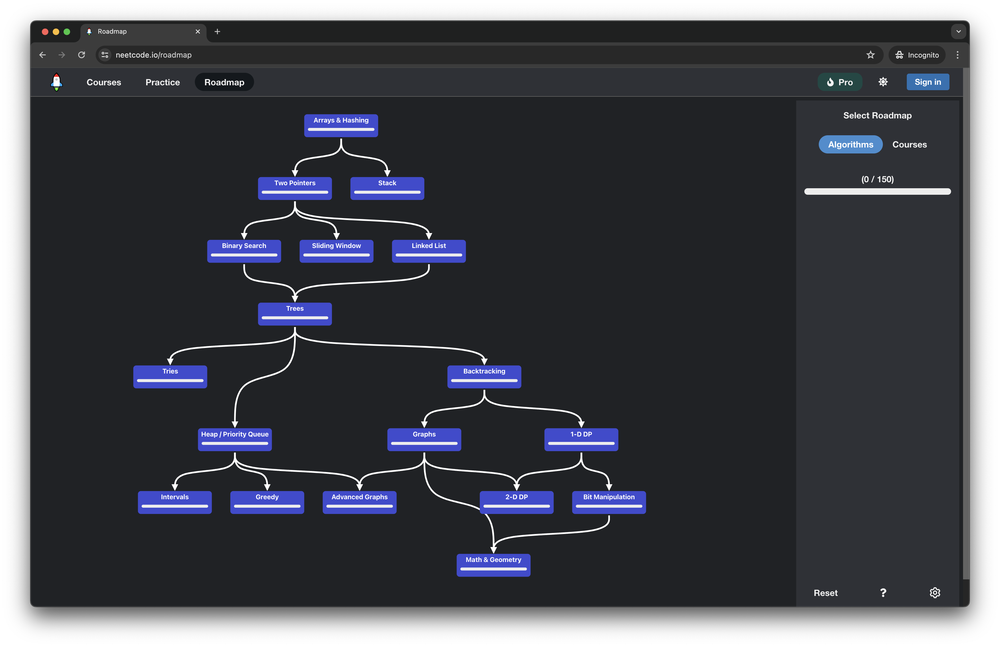

## Introduction to My LeetCode Strategy
After six months of consistent grinding on [LeetCode](https://leetcode.com/) and navigating through about twenty-ish coding interviews, I have finally landed a job at **ByteDance**. Far from a coding wizard, I am an average coder who sticks with medium-level problems until I crack them. Over time, I have cobbled together a few strategies that have surprisingly helped me punch above my weight. Maybe they could work for you too! Stepping into the coding challenges felt like entering a big arena. LeetCode became my training ground, and like many, I often stumbled on the tough problems. But the key? Stick it out and find your rhythm. Here's how I kept my head in the game and punched through those coding challenges.

---

## Personalised Practice Routine
### Daily Goals
I made it my mantra to crack *at least one or two problems daily*. On turbo-charged days, when I felt like it, I would amp it up to three, juggling between easy, medium, and hard to stay sharp and resilient. Picture this: **it's like keeping your brain in a gym session, where every problem solved is a muscle flexed.**

### Timed Sessions
**What's a fight without a timer?** I practised with the clock ticking, mirroring those nail-biting interview settings. (also LeetCode has a timer feature now!) Starting with 10 minutes for easy peasy ones, 30 for the tricky guys, and an hour for the brain-busters. As time went on, I got faster, nailing easies in 5 and hards in 30. You get this weird sixth sense for timing, and bro, does it make you feel like a coding ninja!

Also, remember that it's totally okay to tap out on a hard question and learn from the best answers online. The real trick is to *revisit a similar question later on, ensuring you can solve it the next time around*. Just promise yourself that if you peek at the answer once, you must solve it on your own the next time you encounter it. Once you nail the concept, lock it away in your mental solution bank for future challenges!

### Review and Reflect
After each practice session, I would hold a little debrief, asking myself: What went well? What tripped me up? It felt like reviewing game tape—*always revealing*. Post-interview, I would revisit the questions, diving into similar ones, making my notes, to make sure the lessons really stuck.

Personally, I discovered the best way to avoid simply memorising solutions like a robot is to **keep things mixed up**—switching topics weekly or even tackling random daily questions. This approach really keeps your brain on its toes! Sticking to one topic like **Graphs** for a week, then **Hash Maps** the next week, may seem organised, but from experience, it tends to lead more to memorisation than actual understanding and thinking. Mixing it up has shown me that true learning comes from grappling with problems dynamically, understanding not just the "how" but the "why" behind the list of solutions you have in your solution bank!

### Weak Areas First
I took the plunge into the areas that scared me the most, tackling my weaknesses head-on. It was uncomfortable, sure, but there's no growth found lounging in comfort zones, right?

I must give a massive shout-out to [NeetCode's](https://neetcode.io/) roadmap—it **was a game-changer** during my job search. Following their structured approach really helped; it lays out what you need to grasp fundamentally before moving on to more challenging topics like **2D Dynamic Programming** and **Advanced Graphs**. Understanding the essentials first, then progressively tackling more complex areas, is truly the way to go. **Remember, there's no shortcut to real mastery.**

### Mock Coding Interview Sessions
Huge shoutout to my friends, [Desmond Yong](https://www.linkedin.com/in/desmondyst/) and [Darren Leo](https://www.linkedin.com/in/darren-leo-463010209/), for those invaluable and unforgettable mock sessions we managed to fit in before work, during LeetCode marathons at McDonald's, on off days, and after hours. We all worked at the same company and the same office, making these gatherings not just convenient but incredibly rewarding. These sessions were absolutely priceless! Sure, there are plenty of platforms for practice—and yes, we used them—but nothing compares to the real-time feedback, playful roasting, and engaging discussions with pals over a whiteboard. It was all in good fun and brought massive gains, as we learnt from each other's unique approaches and questions.

For our practice sessions, we often turned to [Soc-tips.com](https://soc-tips.com/), taking turns leading serious mock interviews and utilising the platform's feedback features to capture key insights and improvements.

I have personally found that explaining and sharing what I learn is the best way to solidify my understanding. Here's why:

- **Seneca**, the great philosopher, once said: **"While we teach, we learn."** This idea is at the heart of the **Protégé Effect**, which suggests that teaching what we've learnt to others enhances our own understanding.
- Research shows that explaining concepts to others, especially those unfamiliar with the topic, can significantly deepen your own comprehension.

I often apply this method in my personal life, simplifying complex algorithms for my family. One of my favorite explanations was about **Manacher's algorithm** for finding the longest palindromic substring in a string. I shared how cleverly the algorithm adds a special character to transform the problem into one that can be "calculated" and "decided" through code. This not only reinforces my grasp of the concepts but also shows how these algorithms can be used in real life.

### Discipline Over Distraction
Here's the kicker—I committed to a digital detox. Social media, gaming, endless scrolling—**all cut out**. My eyes were set on the prize: landing a dream job at a big tech company. At that time, I was all in with the **Law of Attraction**, deeply believing that I would make it—and I did. Every spare moment was dedicated to LeetCode; on the bus home, on the way to the gym, on the metro (MRT)—you name it, I was coding, even jotting down diagrams on my iPad (which I bought specifically for interview prep and now doubles as my secondary screen). It was tough to turn down casual hangouts and tempting job offers, but maintaining focus was essential.

---

## Really Useful Resources!
Here's a roundup of materials and resources that have been instrumental in my coding journey. Whether you're gearing up for Technical Coding Interviews or just looking to hone your coding skills, these links might just be what you need:

### The Important Ones
- [My Notion LeetCode Challenge](https://www.notion.so/enkr/LeetCode-challenge-af5b4b790deb4dd5b5f7e990c18f65c5) - I used that to track my LeetCode progress and keep my solutions.
- [Cracking the Coding Interview](https://www.crackingthecodinginterview.com/) - The quintessential book by Gayle Laakmann McDowell; it's a bible for coding interviews.
- [NeetCode](https://www.neetcode.io/) - Fantastic for brushing up on your coding interview skills with neat, categorized problems.
- [YouTube - LeetCode's Advice (Best Explanation, imo!)](https://youtu.be/2V7yPrxJ8Ck?si=Bt0hIhtgsRp4SOdJ)

### YouTubers
- [Back To Back SWE](https://www.youtube.com/@BackToBackSWE) - One of my favorite tech interview prep gurus on YouTube. His explanations are super clear and very helpful.
- [HackBear 泰瑞](https://www.youtube.com/@hackbearterry) - Anotehr My favorite tech guy on YouTube (btw, his videos are in Chinese). His explanations and sharings were invaluable and insightful.

### GitHub
- [Interview Prep](https://github.com/woojiahao/interviews) - A comprehensive repository of interview preparation materials and resources.
- [Catalogue](https://github.com/G33kzD3n/Catalogue) - You can find some system design-related books here for free!
- [Tech Interview Handbook](https://github.com/yangshun/tech-interview-handbook) - Curated coding interview preparation materials for busy software engineers.
- [Summer 2024 Tech Internships - Singapore](https://github.com/kxrt/Singapore-Summer2024-TechInternships)
- [SG Tech List](https://github.com/paradite/sg-tech-list)
- [Coding Interview University](https://github.com/jwasham/coding-interview-university)
- [labuladong 的算法小抄](https://github.com/labuladong/fucking-algorithm)
- [SREWorks](https://github.com/alibaba/SREWorks)
- [Site Reliability Engineer (SRE) Interview Preparation Guide](https://github.com/mxssl/sre-interview-prep-guide)
- [Data Structure and Algorithm Training](https://github.com/NirmalSilwal/Data-Structure-and-Algorithm-Java-interview-kit)

### Other
- [Blog - Emre's Programming Guides](https://emre.me/) - Useful articles and guides on various programming topics and interview preparations.
- [Grokking Modern System Design Interview for Engineers & Managers](https://www.educative.io/courses/grokking-modern-system-design-interview-for-engineers-managers)

> Feel free to dive into any of these resources to boost your coding prowess and interview readiness! And if you have some favorites of your own, I would love to hear about them—please share!

---

## Conclusion: Encouragement and Final Thoughts
Six months of intense coding, and the results speak for themselves. **Remember, perseverance is key**. Just your average coder here, but one who stuck to the game plan and saw it through against the odds.

As a Software Engineer, this journey wasn't just about mastering coding—it encompassed honing your soft skills as well, from that initial HR calls and behavioral interviews to project management discussions and online assessments. It was all about setting a definitive and clear goal and doing whatever it took to achieve it. I hope this story inspires you to develop your own game plan, one that is both enjoyable and disciplined. **And always remember, do not despair in the face of rejections; you're not truly losing if you're actually trying your best. The best is yet to come.**

Looking forward to sharing more and tackling this coding journey with you. Let's keep those codes compiling and our spirits high!

**Keep grinding, trust the process, it will pay off.**
