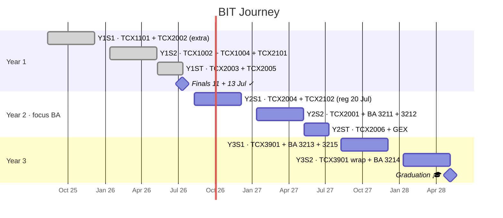

## Journey

_Term rows flip to `done`/`active` at each rollover. Sem boundaries beyond Y1 are approximate — exact dates land with each SCALE circular._

## Where I Am

**68 / 120 units counted · 7 modules done · Year 2 next (TCX2004 + TCX2102, register 20 Jul 2026) · focus area: Business Analytics · 3-year track, AY2025/26 cohort.**

## Modules Done

| Module | Term | Field | One thing it taught me |
|--------|------|-------|------------------------|
| TCX1101 Foundational Mathematics | Y1S1 | Math | Vectors, calculus, complex numbers — the numeracy base everything else stands on. |
| TCX2002 Business Analytics | Y1S1 | Analytics | R, stats, model complexity — the groundwork for my BA focus area. |
| TCX1002 Programming (Python) | Y1S2 | Programming | For library-heavy work, a helpsheet with multiple idioms beats one canonical example. |
| TCX1004 Mathematical Techniques | Y1S2 | Math | Worked examples carry an open-book helpsheet further than restated theory. |
| TCX2101 Calculus & Linear Algebra | Y1S2 | Math | Knowing the content isn't the same skill as choosing the right method under time. |
| TCX2003 Database Systems | Y1ST | Data | SQL rewards the declarative keyword (UNIQUE, EXISTS) where instinct reaches for a procedural check. |
| TCX2005 Information Systems & Management | Y1ST | Systems | An open-book sheet's job is fast lookup — a keyword index with page refs beats self-contained prose. |

_Grades land ~Aug 2026; this table records them when they do._

---

_A degree status view, kept coarse on purpose. Per-topic mastery, quiz history and study notes live in a private coursework repo where the work actually happens — this page only tracks module status + trajectory, so it stays current between terms. Updated at module completion and term rollover, not per session._
