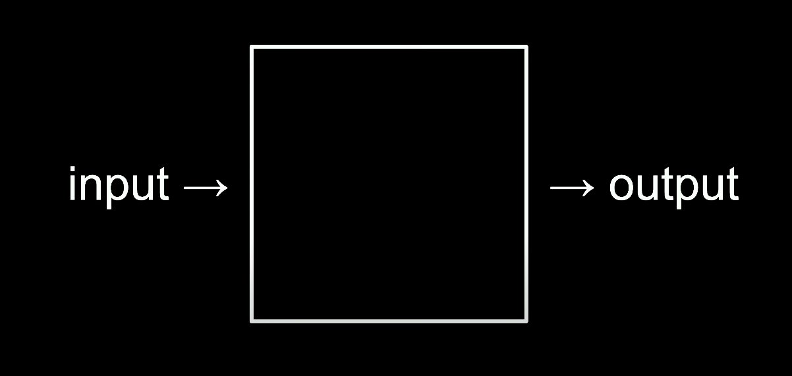

**References**
- YouTube: [Harvard CS50 (2023) – Full Computer Science University Course](
https://youtu.be/LfaMVlDaQ24?si=8Iv9r7XYzZBxDpW0)

## Lecture 1 - Scratch
### What is Computer Science?
Computational thinking

Problem solving?

<!-- more -->

Taking attendance - **unary** - which is ur finger, toes, etc.

Computer uses **bi**nary digi**t** a.k.a bit
Human uses **dec**imal digit

#### Binary (0,1)
Light bulb example

Metaphorically as light bulb, computer has millions of transistors

8 bits = 1 byte (e.g. file size)

## TODO!
- [Harvard Professor Explains Algorithms in 5 Levels of Difficulty | WIRED](https://youtu.be/fkIvmfqX-t0?si=O1-IzLVtTpjzS0Gu)
- https://www.youtube.com/cs50/videos
