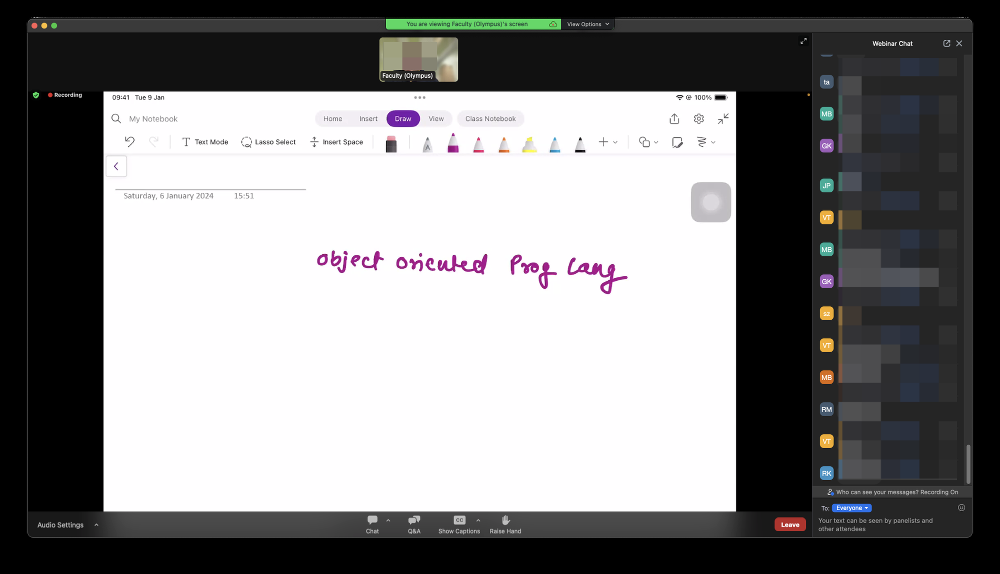
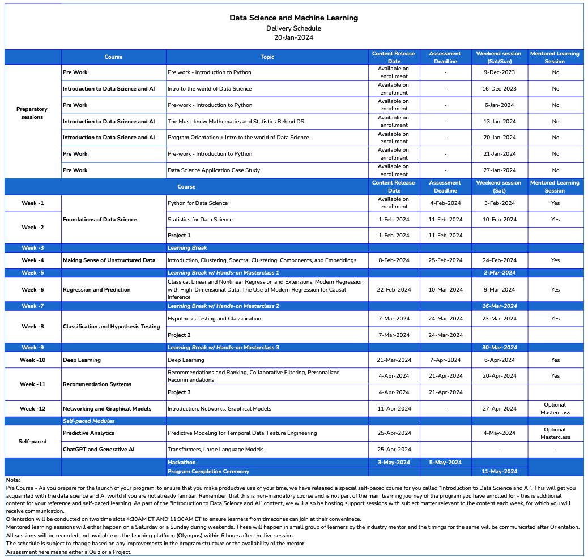
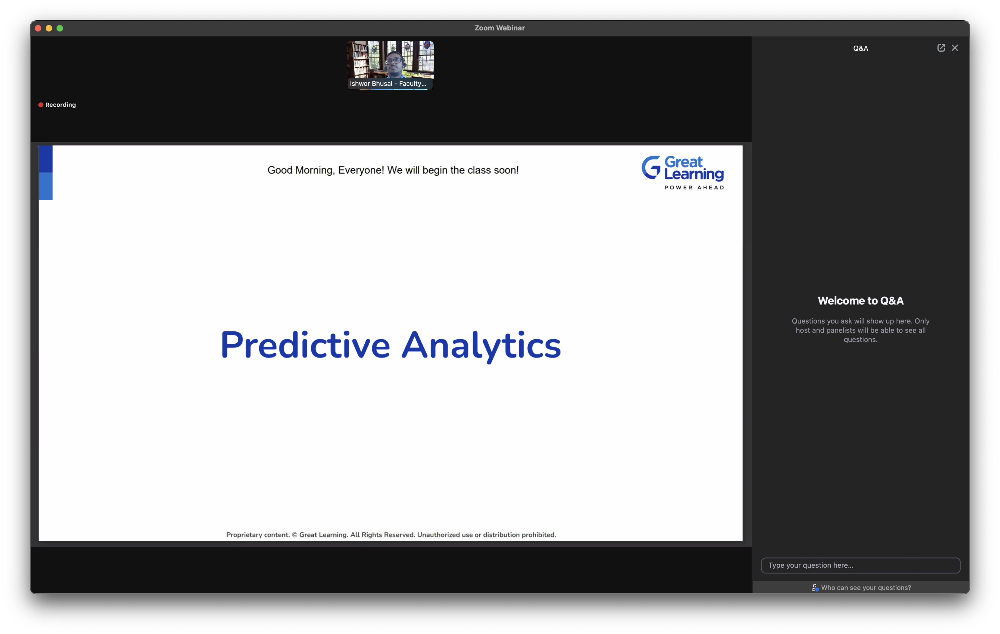

Embarking on a new adventure is always thrilling, and it's even more so when it plunges me into the fascinating realms of **Machine Learning and Artificial Intelligence** through the [MIT IDSS program](https://www.mygreatlearning.com/mit-idss-data-science-machine-learning-program), in partnership with [Great Learning](https://www.mygreatlearning.com/). This journey isn't just about boosting my technical skills—it's about deepening my understanding of the complex world of data. With a keen interest in ML & AI, I'm eager to build a solid foundation of fundamentals that will propel my journey toward greater success!

<!-- more -->

## Why I Chose MIT IDSS by Great Learning
Selecting the optimal path to advance my career in data science was crucial. The collaboration between MIT IDSS and Great Learning grabbed my attention due to its unique blend of academic rigor and real-world industry exposure. The program promises a manageable yet intense workload of 8-12 hours per week, fitting seamlessly into my busy schedule as a working professional eager to enhance my skills.

After comparing options like SkillsFuture Singapore, Udemy, and Coursera, the choice became clear. The faculty from MIT, seasoned experts in Data Science and AI, alongside the promise of interactive, mentor-led sessions at least once a month, convinced me of its value. These elements suggest not just learning opportunities but also the chance to engage with accomplished peers.

I'm approaching this program with an open mind and a critical eye, fully prepared to explore its potential to boost my career. Rest assured, I plan to share candid feedback about my experience and the program's impact once I've made significant progress. Stay tuned for an honest review of whether MIT IDSS meets my expectations and truly enhances my expertise in the field.

## Program Overview
The Data Science and Machine Learning Program by MIT IDSS, in collaboration with Great Learning, blends rigorous academic content with practical industry insights. This structured program requires a commitment of 8-12 hours per week and is designed to fit seamlessly into the schedules of busy professionals.

### Curriculum and Structure
The curriculum starts with foundational topics and escalates to complex areas in data science and machine learning. Courses are organized into weekly modules that include:

- **Recorded Lectures** by MIT Faculty
- **Interactive Mentor-Led Sessions**
- **Hands-On Case Studies**
- **Weekly Assessments**

### Scoring and Evaluation
The program uses a detailed scoring system to evaluate participant performance:

| Component                         | Description                                                          | Marks (Without Project) | Marks (With Project) |
|-----------------------------------|----------------------------------------------------------------------|-------------------------|----------------------|
| **Weekly Quizzes**                | Quizzes based on lecture and reading materials                       | 90                      | 50                   |
| **Project Work**                  | Practical projects to apply learning                                 | N/A                     | 40                   |
| **Attendance (Mentored Sessions)**| Participation in weekly live sessions                                | 10                      | 10                   |

### Attendance and Participation
Active participation and attendance are crucial for succeeding in the program:

| Criteria                          | Scoring                                                          |
|-----------------------------------|------------------------------------------------------------------|
| **Less than 60%**                 | Incomplete (IC)                                                  |
| **60% - 80%**                     | Complete (C)                                                     |
| **Above 80%**                     | Excel (E)                                                        |

### Extension Policy
The program has a strict timeline to ensure consistent progress:

- **Assessments**: Must be submitted by the due dates.
- **Extensions**: Limited to one per program for emergencies, evaluated on a case-by-case basis.

> This program not only aims to enhance your skills but also prepares you to lead in the ever-evolving field of data science and machine learning. As you step into this journey, remember that your instructors and peers are your support network, ready to assist and guide you towards your career aspirations.

## First Impressions: Introduction to Python
The program kicked off with an orientation followed by our first session, "**Prework - Introduction to Python**". This session was designed to lay the groundwork for upcoming topics and refresh fundamental programming skills. As someone who already possesses a solid foundation in programming, the content felt quite basic. However, revisiting these fundamentals is always beneficial in strengthening my understanding and ensuring no detail is overlooked.

Despite the straightforward nature of the material, the first mentored session did not quite meet my expectations in terms of interaction. It felt more like a standard online course rather than an engaging classroom experience. This *lack of dynamic interaction was a bit of a letdown, yet I am optimistic about future sessions*. I look forward to them fostering a more collaborative and engaging atmosphere, one that is crucial for deeper learning and professional growth.

## My Plan
Accoridng to my schedule:

I want to make the most out of this program and I have set a few personal goals:
1. **Engage Fully**: Actively participate in all mentored learning sessions and group discussions.
2. **Stay Organised**: Keep up with the weekly schedule and assessments to avoid falling below total score of 95% and to keep attendance at 100%.
3. **Apply Learning**: Implement concepts through personal projects or at my current job to solidify understanding whenever its possible!

## Conclusion: A Journey of Learning and Growth
For me, this program extends beyond just mastering algorithms or enhancing my Python coding skills; it's about grasping the broader impact of Machine Learning and Artificial Intelligence in tackling real-world challenges. I am eager to discover where this journey will take me and how it will refine my contributions to the field of data science.

I look forward to sharing more insights and developments as I dive deeper into this fascinating field! Feel free to join the conversation—share your thoughts and experiences in ML & AI either here in the comments or in my upcoming posts. Let's explore these transformative technologies together!

## References (Links might be useful)
- [Master data science interview questions: Learn the top 100+ questions](https://datasciencedojo.com/blog/data-science-interview-questions/)
- [8 Of The Best Data Science Books for Learning The Science Of Data](https://bookriot.com/data-science-books/)
- [14 data scientists you should follow on Twitter](https://techbeacon.com/enterprise-it/14-data-scientists-you-should-follow-twitter)
- [Data Science vs. Artificial Intelligence vs. Machine Learning vs. Deep Learning](https://towardsdatascience.com/data-science-vs-artificial-intelligence-vs-machine-learning-vs-deep-learning-9fadd8bda583)
- [25 Data Science Applications and Examples](https://builtin.com/data-science/data-science-applications-examples)

---
<!--
TODO: Use it for last class

-->
