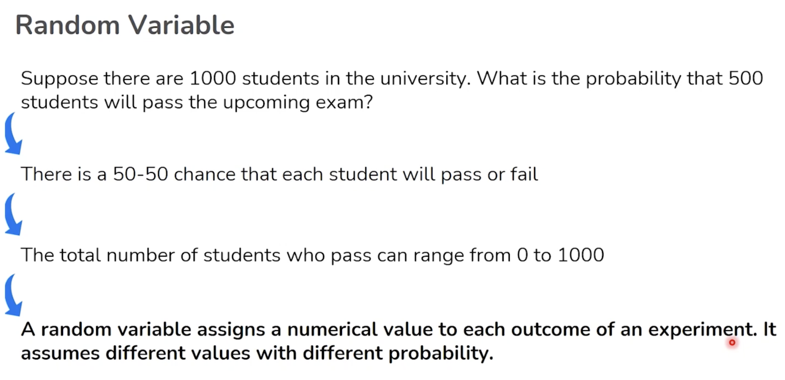
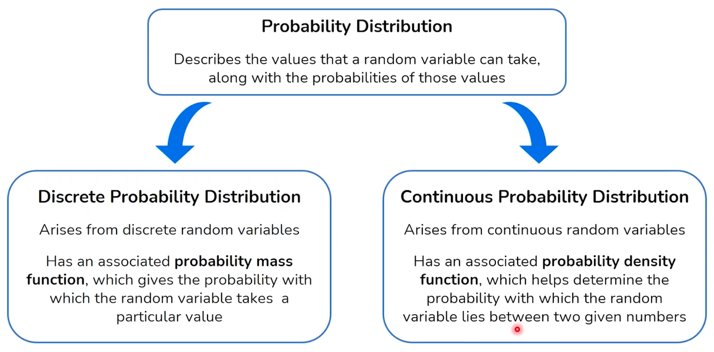
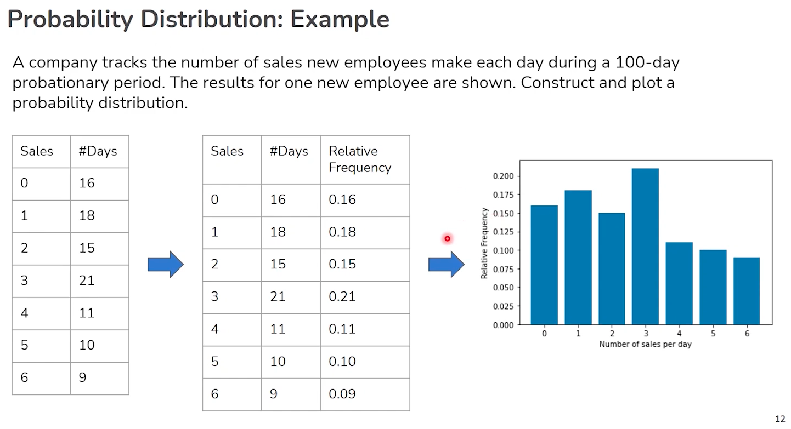

For myself:
```sh
cd /Users/enkr/Personal/_mit_idss/week_2/Notebook_Inferential_Statistics.ipynb
```

## Getting Started with Inferential Statistics
Inferential statistics provide the backbone for making predictions and decisions in data science. By examining a sample of data, we can infer properties about a larger population. This approach is not only practical but necessary, as it is often impractical or impossible to examine an entire population.

- Inferential statistics involve using sample data to make generalisations and predictions about a larger population.


### Key Concepts in Inferential Statistics:
- **Confidence Intervals:** These help us estimate a population parameter with a stated level of confidence. For example, a 95% confidence interval suggests that we can be 95% certain that the population parameter falls within this range.
- **Hypothesis Testing:** This allows us to make decisions about the data. Is there a significant effect? Does a sample meet a certain standard? We use hypothesis tests to answer these questions, relying on the formulation of null and alternative hypotheses.


### Important Statistical Tests:
- **T-tests and ANOVA:** Useful for comparing means across groups.
- **Chi-Square Tests:** Often used to examine relationships between categorical variables.
- **Regression Analysis:** Helps in understanding the relationships among variables.


## Diving Into Distributions
Understanding different types of distributions is crucial in inferential statistics as they describe how values are dispersed or spread. This section explores common distributions encountered in data analysis.


### Common Statistical Distributions:
- **Binomial Distribution:** Used for binary outcomes (e.g., success/failure) across a set number of experiments.
- **Normal Distribution:** Applies to many natural phenomena and indicates how data points are symmetrically distributed around the mean.
- **Poisson Distribution:** Ideal for modelling the number of times an event occurs within a fixed interval of time or space.


## Sampling and Estimation
Sampling techniques are fundamental in statistics, allowing us to draw conclusions about populations without needing to survey every individual.


### Techniques and Theories:
- **Sampling Methods:** Include random, stratified, and cluster sampling, each with specific uses depending on the research question.
- **Central Limit Theorem:** A key statistical theory that justifies using the sample mean to estimate the population mean, assuming the sample size is sufficiently large.


## Practical Application: Using Statistics to Make Decisions
Statistics is not just about understanding data; it's about making decisions based on that data. Whether you're in marketing, finance, health, or any other sector, the ability to make informed decisions through statistical methods is invaluable.


### Real-World Examples:
- Determining the effectiveness of a new drug.
- Forecasting sales based on historical data.
- Optimizing logistical operations to improve efficiency.

## Random Variable
> A random variable is a variable whose possible values are numerical outcomes of a random phenomenon. There are two types of random variables. e.g. If i dont buy bread today, doesnt mean i will buy tomorrow.


1. **Discrete Random Variable**

    This type of variable assumes specific values and results from a countable number of outcomes. Examples include the number of heads when flipping a coin multiple times, or the number of students present in a class.
    > e.g. 1, 2, 3 students

2. **Continuous Random Variable**

    This type takes on an infinite number of possible values, often measurements, and results from a continuum of outcomes. An example would be the time it takes for a computer to boot up or the amount of milk in a jug.
    > e.g. 120.213 ml for a jug of milk

### Probability Distribution for RV




- Think of a random variable (RV) as a box of surprises. Every time you reach into the box, you pull out a surprise, and that surprise is a result of some random event, like a number or an outcome.
- A discrete random variable is like a box with labeled balls: you can count them, and each one has a number. For example, if you have a box with balls labeled 1, 2, 3, ... up to 10, picking a ball is a discrete random event because there are a countable number of balls.
- The probability distribution for a discrete RV is like a recipe that tells you how likely each ball is to be picked. It's like saying, "Ball number 1 has a 10% chance, ball number 2 has a 20% chance, and so on."
- A continuous random variable, on the other hand, is like a spectrum of colors in a rainbow. You can't count them because they smoothly transition from one to another. For instance, the exact amount of milk in a jug could be any number between 0 liters and the jug's capacity.
- The probability distribution for a continuous RV tells you the likelihood of getting a color in a certain range, like "there's a 30% chance of seeing shades of blue between these two points on the rainbow." Since there are infinitely many points, the chance of picking one exact point (or one exact amount of milk) is practically zero.

To sum it up, a random variable represents the outcomes from a random event, and the probability distribution is like a guide that tells you how likely each outcome is. Discrete RVs have countable outcomes, and their probability distribution is a list of chances, while continuous RVs have an infinite range of outcomes, and their distribution is more like a continuous curve that shows the chances over a range.

### Discrete vs Continuous Data: Understanding Probability Distributions
| **Aspect**                   | **Discrete Data**                              | **Continuous Data**                              |
| ---------------------------- | ---------------------------------------------- | ------------------------------------------------ |
| **Definition**               | Values that are countable and distinct         | Values that can take on any value within a range |
| **Examples**                 | Number of students, die rolls                  | Height, weight, temperature                      |
| **Nature**                   | Can only take specific values                  | Can take any value within a range                |
| **Measurement**              | Counted                                        | Measured                                         |
| **Graphical Representation** | Bar charts, pie charts, frequency distribution | Histograms, line graphs, scatter plots           |
| **Variability**              | Limited by the number of outcomes              | Infinite possibilities within intervals          |
| **Value Changes**            | Jump from one value to another                 | Can change gradually                             |
| **Type of Analysis**         | Frequencies, mode, probability                 | Mean, median, mode, standard deviation, variance |


## Types of Distributions
### 1. Bernoulli Distribution (Discrete Random Variable - DRV)
Imagine flipping a coin. There are only two possible outcomes: heads or tails. This is a Bernoulli distribution, where an event has only two outcomes: success (1) or failure (0). For example, flipping a coin and getting heads (success) or tails (failure).

### 2. Binomial Distribution (DRV)
Think about flipping a coin multiple times. Let's say you flip it 10 times and you're interested in how many times it lands on heads. The binomial distribution is used when you have a certain number of independent Bernoulli trials (like multiple coin flips) and you count the number of successes (like landing on heads).
- The number of trials, `n`, is fixed.
- There are only two possible outcomes per trial.
- The probability of success, `p`, remains constant across trials.

### Probability Mass Function
The probability mass function for the binomial distribution is given by:

$$P(X = x) = \binom{n}{x} p^x (1 - p)^{n - x}$$

---
Where:

$$\binom{n}{x}$$ is the binomial coefficient, calculated as $$\frac{n!}{x!(n-x)!}$$

- `n` is the number of trials
- `x` is the number of successes
- `p` is the probability of success on an individual trial

### 3. Uniform Distribution (Continuous Random Variable - CRV)
Imagine you have a bag of marbles, and every marble is a different colour. If each marble is just as likely to be picked as every other marble, this is a uniform distribution. It's like having an equal chance of drawing any number between 1 and 6 when you roll a fair die.

### 4. Normal Distribution (CRV)
Picture a classic bell-shaped curve. This is a normal distribution, often seen in nature and human-made processes. For example, the heights of people in a population are normally distributed—most people are of average height, a few are very short, and a few are very tall. This distribution is symmetrical around the mean (average), and it describes many natural phenomena where values cluster around a central mean.

To remember these, think:

- **Bernoulli**: Coin flip (2 outcomes).
- **Binomial**: Multiple coin flips (counting successes).
- **Uniform**: Fair die roll (equal chance for all outcomes).
- **Normal**: Human heights (average is most common, extremes are less so).

Each distribution tells a story about the likelihood of different outcomes and helps us understand and predict patterns in the real world.

wip ...

$$CI = \bar{x} \pm z \times \left(\frac{\sigma}{\sqrt{n}}\right)$$
