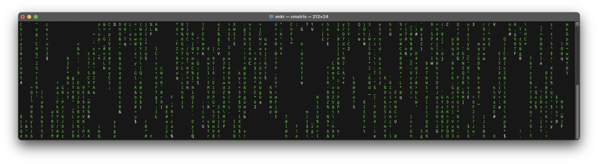
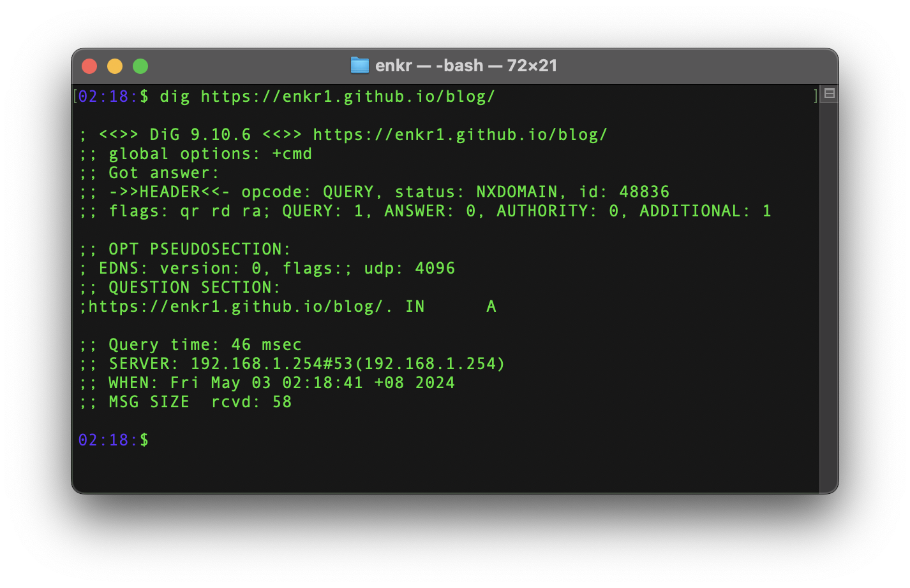
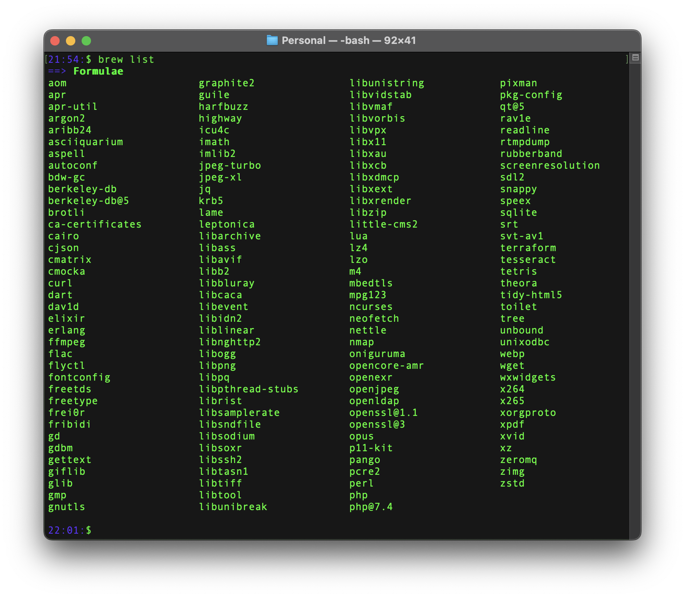

<!--

Getting Started with Bash
Intermediate Techniques
Advanced Bash Scripts and Tricks

-->



Through this post, I aim to share some of the tips and tricks I have gathered along my journey with Bash. I am not an expert, my experiences have taught me valuable lessons that I believe can benefit others, and I'm excited to share them with you! Whether you're a Bash beginner or have some fundamentals under your belt, I hope you'll find something here that enhances your command line prowess. And, of course, I invite you to share your own insights and experiences in the comments below—let's learn from each other and grow together!

<!-- more -->

---

## What is Bash?
When we speak of the **command line**, we are really referring to the shell. The shell is a program that takes keyboard commands and passes them to the operating system to carry out. Almost all Linux distributions supply a shell program from the GNU Project called `bash`. The name is an acronym for `bourne-again shell`, a reference to the fact that Bash is an enhanced replacement for `sh`, the original Unix shell program written by [Steve R. Bourne](https://en.wikipedia.org/wiki/Stephen_R._Bourne).

In the realm of software engineering, the command line holds a special place. It's the backbone of automation, the gateway to system administration, and the tool of choice for the discerning developer. Among the various shells available, Bash stands out as a symbol of **efficiency** and **flexibility**. As someone deeply enamored with the elegance of Bash, I have embarked on a journey to explore its depths and harness its potential.

To me, Bash is more than just a tool; it's the soul of the computer. It's where magic happens, where commands come to life, and where true power resides. With just a few keystrokes and the mighty `sudo`, one can orchestrate the symphony of the system, all *without the need for a mouse*. It's this simplicity and potency that have made me a fervent advocate of Bash.


## Efficiency is key!
As someone who values efficiency (lazy person... in short :D), I often look for "shortcuts" to streamline my workflow. In the world of bash scripting, these shortcuts are known as `alias`. They allow you to abbreviate long commands or frequently used command sequences into simple, memorable shortcuts.

Here's how you can set up your own aliases to enhance productivity, especially when you find yourself repeatedly typing the same commands:

```sh
# Basics
alias h="history"
alias ?="pwd"

# show everything in that directory // list long format including hidden files
alias ll="ls -rslah"

# You can use the ls command to create an alias to help you find where you left off:
alias left='ls -t -1'

# Stole it from Lionel (ex-company's leader HAHA!)
alias ,="cd .."

alias wt="curl wttr.in/Singapore?FQ" # A nerdy way to check the weather ...
alias listen="sudo lsof -i -P -n | grep LISTEN"
# My IP in the network
alias ip="ipconfig getifaddr en0 | tee >(pbcopy)"
# Router IP address
alias routerip="curl ipecho.net/plain ; echo"
# List all open files and network connections that are in a listening state on your system.
alias listen="sudo lsof -nP -iTCP -sTCP:LISTEN"

# You may also:
# Apache's
alias res="sudo apachectl restart"

# Elixir's
alias log="tail -f /var/app/xxx_releases/$RELEASE/tmp/log/erlang.log.1"
alias remote="/var/app/xxx_releases/$RELEASE/bin/xxx remote"
alias deploy="sudo killall beam.smp && /var/app/xxx/_deploy/update_prod"
```
> These are my most used commands on a daily basis

To make these aliases permanent, add them to your `.bashrc` or `.bash_profile` file, taking `.bash_profile` as an example, you may:
```sh
vim ~/.bash_profile
```

OR, personally I prefer to just open it on my visual studio code:
```sh
code ~/.bash_profile
```

With these simple steps, you can greatly reduce the number of keystrokes needed in your daily tasks and focus more on your development work. I believe having aliases set is the smart way to work efficiently in the command line!

### ls - Options:
| Option | Description                                                               |
| ------ | ------------------------------------------------------------------------- |
| `-r`   | Reverses the order of the sort, oldest first.                             |
| `-s`   | Displays the block size of each file in units.                            |
| `-l`   | Uses a long listing format, showing detailed information about each file. |
| `-a`   | Lists all entries including those starting with a dot (hidden files).     |
| `-i`   | Displays the inode number of each file.                                   |
| `-h`   | Human-readable format, shows file sizes in KB, MB, etc.                   |
| `-t`   | Sorts the output by modification time, newest first (last modified).      |
| `-R`   | Lists directories and their contents recursively.                         |
| `-d`   | Lists directories themselves, not their contents.                         |

These options can be mixed and matched to create a command that fits exactly what you need.

### history
- `history` stores up to 1k commands by default.


## Reading the Manual
Just use `man` followed by the command you want to learn about. The `man` command, short for "**manual**," is a powerful tool available in Unix and Unix-like systems such as Linux and macOS. It provides detailed documentation on a wide range of system commands, utilities, and more. Here's how to use it:
```sh
man <command>
```

For example, to get more information about the `ls` command, you would type:
```sh
man ls
man git
man grep
```

> This command will display a comprehensive manual page for `ls`, covering its usage, options, and examples. `man` covers most of the commands you'll use in the terminal, offering a great way to dive deeper into commands such as `grep`, `awk`, `systemctl`, and many others.

**Remember:**
- Not every tool or script has a `man` page, especially those that are user-installed.
- Sometimes, the documentation might lag behind the latest updates of software versions.
- The depth of information can be daunting at first but becomes an indispensable resource with familiarity.


## Tips in Linux: Understand Your Server
Bash and Linux are two different things that are often used together.

Linux is a free and open-source operating system that is based on the Unix operating system. It is widely used in servers, supercomputers, and embedded systems, and is popular among developers, system administrators, and other IT professionals.

Bash, on the other hand, is a shell program that runs on top of Linux (and other Unix-like systems) and provides a command-line interface for users to interact with the system. It is also a scripting language that allows users to write scripts to automate tasks and perform complex operations.

### Here are some differences between Bash and Linux:
1. Bash is a program, while Linux is an operating system. Bash runs on top of Linux (or other Unix-like systems) to provide a command-line interface for users to interact with the system.
2. Bash is a shell program that provides a command-line interface and scripting language, while Linux provides the underlying operating system services such as memory management, process scheduling, and device drivers.
3. Bash is one of several shell programs available on Linux. Other shell programs include sh, csh, and zsh. Users can choose the shell program that best suits their needs.
4. Linux is an operating system that comes in different distributions, such as Ubuntu, Fedora, and Debian. Each distribution provides a different set of tools, software, and user interfaces. Bash, on the other hand, is available on all distributions of Linux.
5. Bash is a powerful scripting language that can be used to automate tasks and perform complex operations. It can also be used to write programs and perform system administration tasks. Linux provides a wide range of system administration tools and utilities that can be used in conjunction with Bash scripts.

> Overall, Bash and Linux are two different things that work together to provide a powerful and flexible system for users to interact with and manage.

| Command  | Description                                                                                                                        |
| -------- | ---------------------------------------------------------------------------------------------------------------------------------- |
| whoami   | Displays current username.                                                                                                         |
| id       | Returns users identity                                                                                                             |
| hostname | Sets or prints the name of current host system.                                                                                    |
| uname    | Prints basic information about the operating system name and system hardware.                                                      |
| pwd      | Returns working directory name.                                                                                                    |
| ifconfig | The ifconfig utility is used to assign or to view an address to a network interface and/or configure network interface parameters. |
| ip       | Ip is a utility to show or manipulate routing, network devices, interfaces and tunnels.                                            |
| netstat  | Shows network status.                                                                                                              |
| ss       | Another utility to investigate sockets.                                                                                            |
| ps       | Shows process status.                                                                                                              |
| who      | Displays who is logged in.                                                                                                         |
| env      | Prints environment or sets and executes command.                                                                                   |
| lsblk    | Lists block devices.                                                                                                               |
| lsusb    | Lists USB devices                                                                                                                  |
| lsof     | Lists opened files.                                                                                                                |
| lspci    | Lists PCI devices.                                                                                                                 |

With three years of experience (only...) digging into server maintenance and troubleshooting, I have amassed a collection of essential commands that are indispensable for anyone managing servers.

Whether you're setting up, maintaining, or troubleshooting, these commands are likely to be some of your most used tools, I might be wrong please leave a comment below for your favourite commands you used when troubleshooting!

Whether you're setting up, maintaining, or troubleshooting, these commands might just become your new go-to tools—though I could be wrong! Everyone has their favorites, right? I'd love to hear about your favourite set of commands . Drop your top picks in the comments below and let's swap some server-savvy secrets! HAHA!

Here's a deeper look into each one and why you should know them:

### OS Details Check
Discover what's running under the hood:
```sh
cat /etc/os-release
```

> Output:
```text
NAME="Amazon Linux"
VERSION="2023"
ID="amzn"
ID_LIKE="fedora"
VERSION_ID="2023"
PLATFORM_ID="platform:al2023"
PRETTY_NAME="Amazon Linux 2023"
ANSI_COLOR="0;33"
CPE_NAME="cpe:2.3:o:amazon:amazon_linux:2023"
HOME_URL="https://aws.amazon.com/linux/"
BUG_REPORT_URL="https://github.com/amazonlinux/amazon-linux-2023"
SUPPORT_END="2028-03-01"
```

This command provides key details about your Linux distribution—essential for compatibility and troubleshooting.


### Kernel Version
Check your core:
```sh
man uname # Read manual as always
uname
uname -a
uname -v # Get kernel version
```


### CPU Info
Understand your processor that reveals the CPU architecture, capabilities and for performance tuning:
```sh
lscpu
```

### Memory Info
Monitor your RAM usage:
```sh
free -h
```


### Disk Space
Keep an eye on storage:
```sh
df -h
```

### Network Interfaces
List all network interfaces and IP addresses to ensure your network settings are correct:
```sh
ip addr
```


### System Services
Manage background processes:
```sh
systemctl status
```

### Reminder: System Update

#### Why Update?
- **Security:** Patch vulnerabilities
- **Stability:** Fix bugs
- **Performance:** Enhance speed
- **Compatibility:** Ensure software works well together

#### How to Update - `yum`:
1. **Check for Updates:**
   ```sh
   sudo yum check-update
   ```
2. **Apply Updates:**
   ```sh
   sudo yum update -y
   ```
3. **Reboot if Required:**
   ```sh
   sudo needs-restarting -r
   ```

#### Tips:
- **Regular Checks:** Weekly checks or automated alerts
- **Backups:** *Always back up data before updates*
- **Post-Update Monitoring:** Check for any issues after updates

This concise guide covers the essentials of why and how to keep your system updated using `yum`.

> *What are your go-to tools for server management?*


## z - Powerful navigator
[Z](https://github.com/rupa/z) is a powerful script that speeds up your directory navigation more than you could imagine!

### Installation & Set-up
1. Download the `z.sh` script using `wget`
    ```sh
    wget https://raw.githubusercontent.com/rupa/z/master/z.sh -O ~/z.sh # output to ~/z.sh
    ```

1. Initialise Z
    Add the following lines to your  bash profile fille to initialise the script every time a shell opens:

    ```sh
    printf "\n\n#initialize Z (https://github.com/rupa/z) \n. ~/z.sh \n\n" >> ~/.bashrc
    ```

    OR, directly on your profile:

    ```sh
    # run z.sh by default
    if [ -f ~/z.sh ]; then
      . ~/z.sh
    fi
    ```

3. Reload the Shell
    Apply the changes by sourcing your profile

    For example:
    ```sh
    source ~/.bashrc
    ```

That's it! These steps should make navigating directories quicker and more intuitive like so:

```sh
z myfold # Even tho your folder is named my_folder_xxx, it will always match with the top used directory
```

> Meaning, you have to somehow have some data by using a few times of `cd` before using it.

In short, the more you use it, the better it gets. I hope this guide helps you as much as it has helped me! :D


## grep
One of the most basic command line you should already know! But I am leaving some notes here as I found interesting and useful.

### Simple usage:
```sh
anything | grep the-keyword
```

### Insensitive case:
```sh
ll | grep -i "things-u-wanna-find"
```

> SEARCH: How to show lines Before/After/Around the Match:

more ...


### SRE's must know
**SRE Interview questions I got asked:**
Q2: Which command do you use to count all lines with ERROR keyword (case sensitive)?
```sh
grep "ERROR" ./stderr.log | wc -l
```

Q3: Which command do you use to display 5 lines before and 5 lines after the line with ERROR keyword and line numbers as well?
```sh
grep -A 5 -B 5 -n "ERROR" stderr.log
```

### Some notes
`^` is the start-of-line anchor, it matches the beginning of a line.

```sh
grep ^Host ~/.ssh/config
```

This command is searching for lines in the **`~/.ssh/config`** file that **start** with the word "Host".

```sh
grep ^Host ~/.ssh/config | awk '{print $2}'
```


## awk
`awk` is a powerful text processing tool that's commonly used in UNIX-like operating systems. It excels at column-based operations, making it ideal for data extraction and reporting from structured text data. `awk` is not just a command; it's an entire programming language designed for text processing.

### Basics of `awk`
The basic syntax of `awk` is:
```sh
awk 'pattern { action }' file
```

- **`pattern`**: This specifies the condition for which the **`action`** should be executed. If no pattern is provided, the action is executed for every line.
- **`action`**: This is what **`awk`** does when the pattern matches. Actions are enclosed in **`{ }`**.
- **`file`**: The file you want to process. If no file is specified, **`awk`** reads from the standard input.


## wc - Word Count
- https://linuxhint.com/wc-command-bash/

Get wordcount from a log text file:
```sh
cat log.txt | wc -l
```

Get total occurrences of the word "ERROR" case insensitively and by line:
```sh
cat log.txt | grep -io "ERROR"  | wc -l
```

### wc - Options:
| Option | Description                                  |
| ------ | -------------------------------------------- |
| `-l`   | Count the number of lines in the input.      |
| `-L`   | Display the length of the longest line.      |
| `-w`   | Count the number of words in the input.      |
| `-c`   | Count the number of bytes in the input.      |
| `-m`   | Count the number of characters in the input. |

wip ...


## SSH
### genkey
Keys will be created (id_rsa and id_rsa.pub) under ~/.ssh:
```sh
ssh-keygen -t rsa -b 2048
ssh-keygen -t rsa
```

### pbcopy key
- https://stackoverflow.com/a/2643584/13677125
Copy ~/.ssh/id_rsa.pub to the clipboard:
```sh
cat ~/.ssh/id_rsa.pub | pbcopy
```

### scp
ssh cp into your local folder:
```sh
scp ec2-user@www.test.com:/var/app/project_name/_tmp/xxx.log ~/Downloads/xxx-copy.log
```

## mkdir
### recursively
You can create nested directories recursively using the **`-p`** flag with the **`mkdir`** command. The **`-p`** flag ensures that each directory is created if it doesn't exist, and it won't return an error if the directory already exists.
```sh
mkdir -p ./folder-a/folder-b
```


## `.` as known as `source`
A dot in that context means to "source" the contents of that file into the current shell. With [source](http://ss64.com/bash/source.html) itself being a shell builtin command. And `source` and the `.` operator being synonyms.

Files such as this are often used to incorporate setup commands such as adding things to ones environment variables, e.g. `addvars.sh`:
```sh
export VAR1="some var1 string"
export VAR2="some var2 string"
```

Notice that I don't have any variables in my current shell's environment.
```sh
env | grep VAR
```

Now when I source this file:
```sh
. addvars.sh
```

OK, doesn't seem like it did anything, but when we check the `env` variables again:
```sh
env | grep VAR
env -0 | sort -z | tr '\0' '\n'
```
output:
> VAR1=some var1 string
> VAR2=some var2 string

OR, you may check all env by doing:
```sh
printenv
printenv | sort
```

wip ...


## curl

wip ...

## chmod
- https://chmod-calculator.com/

The `chmod 777` command in Linux is used to set the permissions of a file or directory to be fully open. Specifically, it permits read, write, and execute permissions for the owner, the group, and others. Here's how it breaks down:

- The first `7` sets the owner's permissions to `read(4) + write(2) + execute(1) = 7`
- The second `7` sets the group's permissions to `read(4) + write(2) + execute(1) = 7`
- The third `7` sets the permissions for others to `read(4) + write(2) + execute(1) = 7`

So, a `chmod 777` on a file means that anyone can read, write, and execute the file. For a directory, it means anyone can view, modify, or enter the directory. This is usually considered insecure for most cases because it allows anyone to modify the file or directory.

The `-R` option stands for "recursive." When used with `chmod`, it applies the permission change to the directory and also to all files and subdirectories contained in the directory. For example:

```sh
chmod -R 755 /path/to/directory
```

This will set the directory and all its contents to be readable, writable, and executable by the owner, and readable and executable by everyone else. Subdirectories will also have the same permissions set recursively.

Understanding the implications of different permission settings is vital, especially given your role in managing web applications and DevOps. Incorrectly set permissions can be a security risk or can prevent applications from functioning correctly. Therefore, it's usually best to give the minimum necessary permissions for operation.

Would you like to know more about Linux file permissions, or is there something else you'd like to inquire about?


## gs — GhostScript
- Merge PDFs — https://stackoverflow.com/a/19358402

```sh
gs -dBATCH -dNOPAUSE -q -sDEVICE=pdfwrite -sOutputFile=merged.pdf 2023-*
```

```sh
gs -dBATCH -dNOPAUSE -q -sDEVICE=pdfwrite -sOutputFile=merged.pdf 2023-05.pdf 2023-06.pdf
```

```sh
gs -dBATCH -dNOPAUSE -q -sDEVICE=pdfwrite -sOutputFile=PandJingHui_3months_payslips.pdf 2023-07.pdf 2023-08.pdf 2023-09.pdf
```


## unzip
### Unzip every zipped folder in a directory
```sh
unzip \*.zip
```


## convert
**ImageMagick (Convert)**

- **Primary Use**: Specifically designed for image processing. It's primarily used for creating, editing, composing, or converting bitmap images.
- **Capabilities**: Offers a wide range of options for image manipulations such as resizing, flipping, mirroring, rotating, distorting, shearing, transforming, and more. It also supports a vast number of image formats.
- **Simplicity for Images**: Generally provides simpler and more direct commands for image manipulation and conversion, making it more suitable for tasks that solely involve images.

```sh
for file in *.JPG; do
  convert "$file" "${file%.jpg}.jpeg"
done
```

### 1. **FFmpeg**

- **Primary Use**: Primarily designed for video and audio processing. It excels at handling multimedia data streams and complex encoding and decoding processes.
- **Capabilities**: Can handle batch processing of video and audio files, applying filters, changing codecs, and modifying multimedia files in various ways.
- **Complexity**: Typically offers more complex and detailed command-line options for video and audio processing, which might be overkill or less efficient for simple image conversions.

### 2. **ImageMagick (Convert)**

- **Primary Use**: Specifically designed for image processing. It's primarily used for creating, editing, composing, or converting bitmap images.
- **Capabilities**: Offers a wide range of options for image manipulations such as resizing, flipping, mirroring, rotating, distorting, shearing, transforming, and more. It also supports a vast number of image formats.
- **Simplicity for Images**: Generally provides simpler and more direct commands for image manipulation and conversion, making it more suitable for tasks that solely involve images.

### Practical Differences in Usage

- **Efficiency**: For image file conversions, ImageMagick is generally more efficient and provides tools better suited for the job with less overhead compared to FFmpeg.
- **Functionality**: FFmpeg is more powerful for any media format conversion or processing that includes video or audio. However, for straight image-to-image conversion, ImageMagick is usually preferred due to its optimization for images.

In your case, using `convert` from ImageMagick for converting HEIC to JPEG is more straightforward and efficient, given that `convert` is optimized for image operations.

[WIP]


## nbconvert
### Convert Jupyter notebook to specific file type

Convert Jupyter to ...
```sh
! jupyter nbconvert --to filetype 'filename.ipynb'
```

Example:
```
! jupyter nbconvert --to md xxx.ipynb
! jupyter nbconvert --to html xxx.ipynb
! jupyter nbconvert --to html xxx.ipynb
```
> filetype: asciidoc, custom, html, latex, markdown, notebook, pdf, python, qtpdf, qtpng, rst, script, slides, webpdf


## dig - DNS of a website
```sh
dig https://enkr1.github.io/blog/
```



## symlink

To create a new symlink (will fail if symlink exists already):
```
ln -s /path/to/file /path/to/symlink
```

To create or update a symlink:
```
ln -sf /path/to/file /path/to/symlink
```


## ps - Check Processes
The `ps` command in Unix-based systems is used to list the currently running processes.

### Basic Usage
Displays processes associated with the current terminal.

```sh
ps
```

### Extended Usage
- **`-a`**: Show processes for all users.
- **`-x`**: Include processes without a controlling terminal.

```sh
ps -ax
```

This combination (`-ax`) provides a comprehensive view of all active processes on the system, which is useful for full system monitoring or debugging purposes.

### Examples
- To see all processes in a detailed format:
  ```bash
  ps aux
  ```
- To sort processes by memory usage:
  ```bash
  ps aux --sort=-%mem # on Linux
  ps aux | sort -rnk 4 # on Mac
  ```
- To search for a specific process, such as Apache:
  ```bash
  ps aux | grep apache
  ```

> This utility is essential for system administration, allowing you to monitor and manage running processes effectively.


## traceroute
`traceroute` is a network diagnostic tool that tracks the path data packets take from your computer to a destination host, showing each hop and the time taken for each hop.

### Why using it?
- **Diagnose Network Issues:** Identify where delays or packet loss occur.
- **Network Bottlenecks:** Pinpoint problematic segments in the network.
- **Understand Network Topology:** Gain insights into routing paths and network structure.
- **ISP Troubleshooting:** Determine if connectivity issues are local or beyond your ISP.
- **Verify Network Configuration:** Ensure routing paths are correctly configured.
- **Debug DNS Issues:** Check if domain names resolve correctly and trace the path to the destination.

### When to use it?
- **Slow Internet Speeds:** Determine where latency is introduced.
- **Connectivity Problems:** Identify if the issue is within the local network or external.
- **Network Performance Issues:** Locate bottlenecks causing slowdowns.
- **Troubleshooting Remote Servers:** Diagnose access issues to remote servers.
- **Verifying Network Changes:** Confirm that new configurations work as intended.

### How to use it:
1. **Run `traceroute`:**
  ```bash
  traceroute <destination>
  ```
  Example:
  ```bash
  traceroute google.com
  ```

2. **Interpreting Results:**
   - **Normal Hops:** Each hop shows the IP address and round-trip times (RTTs).
   - **High Latency:** Significant RTT increases indicate potential bottlenecks.
   - **Packet Loss:** Asterisks (*) indicate probe timeouts, suggesting packet loss.
   - **Unreachable Destination:** Continuous timeouts or no response indicates routing or connectivity issues.

3. **Additional Options:**
   - Set maximum hops:
   ```bash
   traceroute -m 20 <destination>
   ```
   - Set timeout for each probe:
   ```bash
   traceroute -w 2 <destination>
   ```
   - Set number of queries per hop:
   ```bash
   traceroute -q 1 <destination>
   ```

4. **Learn More:**
View the manual page for detailed options:
```bash
man traceroute
```


## top
Most used CPU processor in real time:
```sh
top
top -o rsize
```


## uptime
Displays how long the system has been running since the last reboot:
```sh
uptime
```


## cal
Show calendar in bash:
```sh
cal
```

## say
HAHAHAHA its just sth funny:
```sh
say whatever you want to say
```

## Start a python web server

```sh
python3 -m http.server
```

## WiFi password
```sh
security find-generic-password -wa wifi-name
security find-generic-password -wa "Starbucks" | pbcopy
```

## Touch ID forever!
vim here & enter password for one last time:
```sh
sudo vim /etc/pam.d/sudo
```

```sh
# sudo: auth account password session
auth       sufficient     pam_tid.so # This is what we need
auth       sufficient     pam_smartcard.so
auth       required       pam_opendirectory.so
account    required       pam_permit.so
password   required       pam_deny.so
session    required       pam_permit.so
```

> Done! You can now unlock sudo with Touch ID like a ninja!


## Setting up with colours
- https://stackoverflow.com/questions/5947742/how-to-change-the-output-color-of-echo-in-linux?lq=1
- https://en.wikipedia.org/wiki/ANSI_escape_code

```sh
# Reset
Color_Off='\033[0m'       # Text Reset

# Regular Colors
Black='\033[0;30m'        # Black
Red='\033[0;31m'          # Red
Green='\033[0;32m'        # Green
Yellow='\033[0;33m'       # Yellow
Blue='\033[0;34m'         # Blue
Purple='\033[0;35m'       # Purple
Cyan='\033[0;36m'         # Cyan
White='\033[0;37m'        # White

# Bold
BBlack='\033[1;30m'       # Black
BRed='\033[1;31m'         # Red
BGreen='\033[1;32m'       # Green
BYellow='\033[1;33m'      # Yellow
BBlue='\033[1;34m'        # Blue
BPurple='\033[1;35m'      # Purple
BCyan='\033[1;36m'        # Cyan
BWhite='\033[1;37m'       # White

# Underline
UBlack='\033[4;30m'       # Black
URed='\033[4;31m'         # Red
UGreen='\033[4;32m'       # Green
UYellow='\033[4;33m'      # Yellow
UBlue='\033[4;34m'        # Blue
UPurple='\033[4;35m'      # Purple
UCyan='\033[4;36m'        # Cyan
UWhite='\033[4;37m'       # White

# Background
On_Black='\033[40m'       # Black
On_Red='\033[41m'         # Red
On_Green='\033[42m'       # Green
On_Yellow='\033[43m'      # Yellow
On_Blue='\033[44m'        # Blue
On_Purple='\033[45m'      # Purple
On_Cyan='\033[46m'        # Cyan
On_White='\033[47m'       # White

# High Intensity
IBlack='\033[0;90m'       # Black
IRed='\033[0;91m'         # Red
IGreen='\033[0;92m'       # Green
IYellow='\033[0;93m'      # Yellow
IBlue='\033[0;94m'        # Blue
IPurple='\033[0;95m'      # Purple
ICyan='\033[0;96m'        # Cyan
IWhite='\033[0;97m'       # White

# Bold High Intensity
BIBlack='\033[1;90m'      # Black
BIRed='\033[1;91m'        # Red
BIGreen='\033[1;92m'      # Green
BIYellow='\033[1;93m'     # Yellow
BIBlue='\033[1;94m'       # Blue
BIPurple='\033[1;95m'     # Purple
BICyan='\033[1;96m'       # Cyan
BIWhite='\033[1;97m'      # White

# High Intensity backgrounds
On_IBlack='\033[0;100m'   # Black
On_IRed='\033[0;101m'     # Red
On_IGreen='\033[0;102m'   # Green
On_IYellow='\033[0;103m'  # Yellow
On_IBlue='\033[0;104m'    # Blue
On_IPurple='\033[0;105m'  # Purple
On_ICyan='\033[0;106m'    # Cyan
On_IWhite='\033[0;107m'   # White

# Example usage
echo -e "${Red}This text is red${Color_Off}"
echo -e "${Black}This text is black${Color_Off}"
```


## brew
- https://formulae.brew.sh/
First, always check the latest info, make sure brew is up-to-date, etc:
```sh
brew -h
brew update
brew upgrade
brew cleanup
```

Checking list of packages like so:
```sh
brew list
```


- https://formulae.brew.sh/formula/ffmpeg
- https://formulae.brew.sh/formula/htop
- https://formulae.brew.sh/formula/docker-compose

wip:
```sh
if [ -x $(command -v ffmpeg) ]; then
    # encode HEVC
    function ff265() {
        ffmpeg -i "$1" -filter:v "scale=in_color_matrix=auto:in_range=auto:out_color_matrix=bt709:out_range=tv" -pix_fmt:v "yuv420p" -colorspace:v "bt709" -color_primaries:v "bt709" -color_trc:v "bt709" -color_range:v "tv" -chroma_sample_location left -crf 20 "$2"
    }
    function ff264() {
      ffmpeg -i $1 -vcodec libx264 -crf 28 $2
    }
    log_verbose "use \033[34mff265\033[0m function to encode HEVC video"
fi
```

---


## Bash Basics: Core Concepts
### mv
Move file:
```sh
mv test ~/Downloads/test
```

Rename file:
```sh
mv this.txt that.txt
```

## cp - Copy file to file/dir
- **cp** - copy files and directories
- **ditto** - copy directory hierarchies, create and extract archives

[What is Difference between cp and ditto command on OSX?](https://stackoverflow.com/a/40974437/13677125)

```sh
cp test.txt ~/Downloads/
cp test.txt copied.txt
```

### Explanation of `&` and `&&`
- **`&`**: This is used to run the command in the background. For instance, `some_command &` would start `some_command` and immediately return you to the command prompt while `some_command` continues to run in the background.
- **`&&`**: This is used to run the second command only if the first command completes successfully. For example, `first_command && second_command` will only execute `second_command` if `first_command` exits with a status of 0 (which indicates success in Unix-like systems).

### Special parameters
https://tiswww.case.edu/php/chet/bash/bashref.html#Special-Parameters

- `$0` — the name of the target script
- `$1` — the 1st arg passed
- `$2` — the 2nd arg …
- `$n` — the `n`th arg …
- `$#` — the number of args
- `$*` — all args as single string

```sh
#!/bin/bash

for arg in "$*"; do
    echo $arg
done
# output: foo bar baz
```

`$@` — all args as list

```sh
#!/bin/bash

for arg in "$@"; do
    echo $arg
done
# output:
# foo
# bar
# abaz
```

### Test conditions

**`[ ... ]`** is a synonym for the **`test`** command. Inside the brackets, you specify a condition, and based on whether this condition is true or false, you can make decisions in your script.

#### Numbers
- **`eq`**: equal to
- **`ne`**: not equal to
- **`gt`**: greater than
- **`ge`**: greater than or equal to
- **`lt`**: less than
- **`le`**: less than or equal to

```sh
if [ "$a" -eq "$b" ]; then
  echo "a is equal to b"
fi
```

#### Strings
- **`=`** or **`==`**: check if two strings are equal
- **`!=`**: check if two strings are not equal
- **`z`**: check if the string is empty
- **`n`**: check if the string is not empty

```sh
str1="hello"
str2="world"

if [ "$str1" != "$str2" ]; then
  echo "The strings are different."
fi
```

### Testing Files

- **`e`**: Check if file exists
- **`f`**: Check if it's a regular file (not a directory or device file)
- **`d`**: Check if it's a directory
- **`s`**: Check if file is not empty
- **`r`**, **`w`**, **`x`**: Check if file is readable, writable, or executable

```sh
filename="./my_script.sh"

if [ -f "$filename" ]; then
  echo "$filename is a regular file."
fi
```


---


## Some Amazing Sources
- [BASH Programming - Introduction HOW-TO](https://tldp.org/HOWTO/Bash-Prog-Intro-HOWTO.html)
- [Useful bash aliases](https://www.cyberciti.biz/tips/bash-aliases-mac-centos-linux-unix.html)
- [How to Remove (Delete) Files in Linux](https://linuxize.com/post/how-to-remove-files-and-directories-using-linux-command-line/)
- [YouTube - 8 Bash Shortcuts Every Linux User Should Know](https://youtu.be/C-AQAJXdoS8)
- [YouTube - My 5 Favorite Linux Shell Tricks for SPEEEEEED (and efficiency)](https://youtu.be/V8EUdia_kOE)

---
